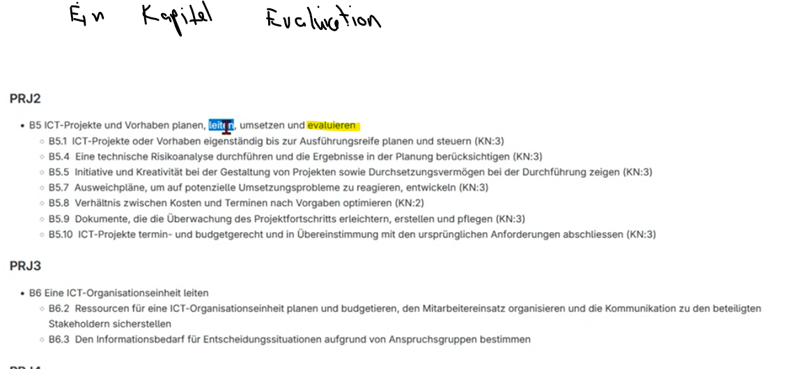

# Projektmanagement Ideen für nächsten Semester

## 1. Projektmanagement

## Resourcen
Gitlab: https://gitlab.com/ch-tbz-wb/Stud/prj/-/blob/main/1_Handlungskompetenzen/README.md

Punkte die drinnen sein müssen PRJ2:

## Risikoanalyse
https://gitlab.com/ch-tbz-wb/Stud/prj/-/tree/main/2_Unterrichtsressourcen/F_RisikoManagement
https://www.theprojectgroup.com/blog/risikomanagement-im-projektmanagement/#:~:text=Wann%20macht%20man%20eine%20Risikoanalyse,im%20gesamten%20Projektverlauf%20wiederholt%20wird.

https://regina-stoiber.com/2019/04/28/risikoanalyse-durchfuehren-mit-muster-vorlage-und-beispiel/

## Wirtschaftlichkeitsanalyse

Risikomanagement:
Technische und organisatorische Risikenanalyse

Abschluss übereinstimmung
Ist Budget eingehalten? wurden Anforderungen erfüllt? Wurde das Projekt rechtzeitig abgeschlossen?

