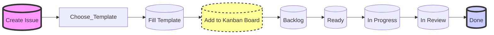

## Issue Management

In meinem Projekt verwende ich GitHub Issues, um die Anforderungen und Aufgaben zu verwalten.

Jedes Issue wird als eigenständige Einheit erstellt, um die Arbeit zu strukturieren und den Fortschritt zu verfolgen.
Die Issues werden im Kanban-Board organisiert und in den Phasen "Backlog", "Ready", "In Progress", "In Review" und "Done" aufgeteilt.

## Issue Beispiel

[Issue für Benachrichtigung](https://github.com/danyambuehl/ITCNE23-SEM-Ill/issues/21){: .btn }

## Issue Workflow



## Issue Template [^1]

Für GitHub Issues wird ein Template verwendet, um die Struktur und den Inhalt der Issues zu standardisieren.
Für jedes Issue wähle Ich das passende Template aus, um sicherzustellen, dass alle relevanten Informationen enthalten sind.

Die Datei `.github/ISSUE_TEMPLATE/feature_request.md` enthält das Template für Feature Requests.

```markdown
---
name: Feature request
about: Suggest an idea for this project
title: "[FEATURE] "
labels: enhancement
assignees: 'danyambuehl'
projects: ITCNE23-SEM-Ill
---

__Story__

As a _user_ I want to ... 
As a _developer_ I want to ... 

In the Story section, describe the user story and the developer story.

__Acceptance criteria__

What needs to be done to consider the story as completed (bullet points)

__UI__

How should the UI look like? (if applicable)

__Data persistence__

How should the data be stored?

__Effort__

T-Shirt Size:

__DoR__

- [ ] Story defined
- [ ] Acceptance criteria defined
- [ ] Effort estimated
- [ ] Team assigned and agrees on story description

__DoD__

- [ ] Tests defined (backend)
- [ ] Tests pass during CI test task
- [ ] Merge request created
- [ ] Demo with product owner planned
```

### Quellen

[^1]: mikro-adventures [Retrieved from](https://gitlab.com/ch-tbz-wb/TE/modules/msvc/mikro-adventures/ma-app/-/issues/7)
