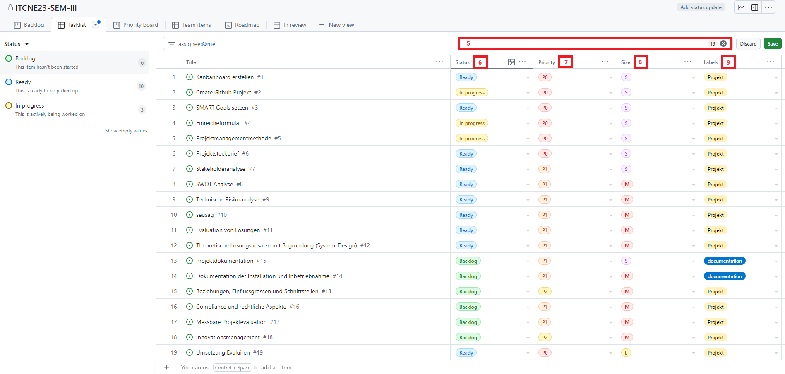

## Projektmanagementmethode

In dieser Semesterarbeit wird die agile Methode Kanban für das Projektmanagement angewandt. Diese Methode visualisiert Arbeitsprozesse und steuert den Arbeitsfluss effektiv. Ihre Flexibilität und Anpassungsfähigkeit sind der Schlüssel für diese Entscheidung.

Die Arbeit wird in mehrere Issues unterteilt, wodurch der Fortschritt nachvollzogen und klare Ziele gesetzt werden können. Die Arbeitsaufgaben werden priorisiert und im Kanban-Board mit den Phasen "Backlog", "Ready", "In Progress", "In Review" und "Done" aufgeteilt.

Für das Gesamtprojektmanagement wird ([Github Project](https://github.com/users/danyambuehl/projects/3)) verwendet. Diese Plattform erleichtert die Zusammenarbeit und Nachverfolgung von Änderungen und sorgt für eine zentrale Verwaltung von Aufgaben, Diskussionen und Ressourcen.

Sprints werden in der Roadmap geplant und dienen als Leitfaden für die Umsetzung der Arbeitspakete. Die Roadmap wird regelmässig aktualisiert und an die sich ändernden Anforderungen angepasst.

Die einzelnen Issues werden in der Taskleiste erfasst und nach verschiedenen Kategorien gefiltert und gruppiert. Die Taskleiste dient zur besseren Übersicht und Strukturierung der Aufgaben.

### Kanban-Board [^1]

Das Kanban-Board bildet das Herzstück des Projektmanagements und bietet eine visuelle Übersicht aller Arbeitsprozesse, hilft Arbeitseffizienz zu erhöhen und Engpässe frühzeitig zu identifizieren. Dadurch ermöglicht es eine Anpassung an sich verändernde Anforderungen während des gesamten Projektablaufs.

### Roadmap [^2]

Eine ausgearbeitete Roadmap dient als Leitfaden für die strategische Planung und Kontrolle der Arbeit. Sie enthält wichtige Meilensteine, die auf die einzelnen Sprints ausgerichtet sind, und dient als Orientierungshilfe für die Fortschrittsverfolgung und den erfolgreichen Abschluss der einzelnen Projektphasen.

### Taskleiste [^3]

Zur Verbesserung der Verwaltung und Organisation von Aufgaben wird eine neue Taskleiste eingeführt. Diese Taskleiste soll dazu dienen, Aufgaben zu erfassen, sie nach verschiedenen Kategorien zu filtern und zu gruppieren. Das Ziel besteht darin, eine bessere Übersicht und Strukturierung im Projektmanagement zu erreichen.

Die neue Aufgabenliste wird so konzipiert, dass jeder einzelne Task mit spezifischen Metadaten versehen werden kann. Dadurch wird eine einfache Zuordnung zu bestimmten Kategorien ermöglicht.

### Priority Board [^4]

Das Priority Board dient zur Priorisierung der Aufgaben und hilft, die wichtigsten und dringendsten Aufgaben zu identifizieren. Es ermöglicht eine klare Zuordnung von Aufgaben nach ihrer Wichtigkeit und Dringlichkeit und erleichtert die Planung und Umsetzung der Arbeitsprozesse.

### Task Kategorien [^5]

- Status
- Priorität
- Grösse
- Label

### Task Status [^6]

Das Kanban-Board wir in 5 Spalten aufgeteilt.

- Backlog
- Ready
- In Progress
- In Review
- Done

### Task Priorität [^7]

Es wird zwischen drei Prioritäten unterschieden nach folgender Reihenfolge.

- P0
- P1
- P2

### Task Size [^8]

Der geschätzte Aufwand für einen Task wird mit folgenden angegeben.

- S
- M
- L

### Task Labels [^9]

Es werden folgende Labels verwendet um die Tasks nach Themen zu gruppieren.

- Dokumentation --> Task für die Dokumentation
- Projekt --> Task für Projekt Planung
- App --> Task für die App Entwicklung

[^1]: Kanban-Board [Retrieved from](/docs/img/kanban-board.png)
[^2]: Roadmap [Retrieved from](/docs/img/kanban-board.png)
[^3]: Taskleiste [Retrieved from](/docs/img/kanban-board.png)
[^4]: Priority Board [Retrieved from](/docs/img/kanban-board.png)
[^5]: Task Kategorien [Retrieved from](/docs/img/tasklist.png)
[^6]: Task Status [Retrieved from](/docs/img/tasklist.png)
[^7]: Task Priorität [Retrieved from](/docs/img/tasklist.png)
[^8]: Task Size [Retrieved from](/docs/img/tasklist.png)
[^9]: Task Labels [Retrieved from](/docs/img/tasklist.png)