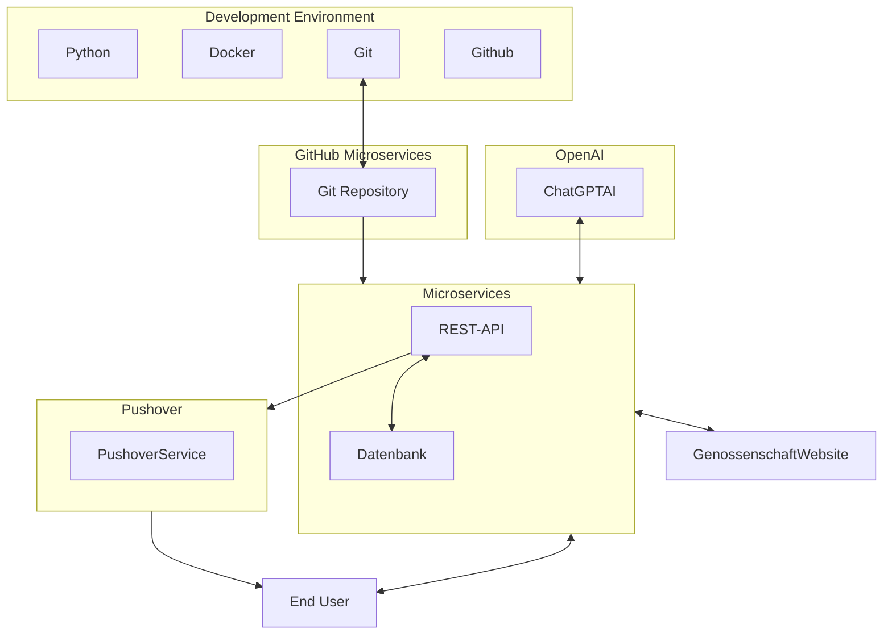

## Projektsteckbrief

In meiner Semesterarbeit konzentriere ich mich auf das aktuelle Problem, bezahlbaren Wohnraum in Zürich zu finden. Das Hauptziel dieser Arbeit besteht darin, den Zugang zu freien Genossenschaftswohnungen effizienter zu gestalten.

Dies werde ich tun, indem ich das Problem aus der Perspektive eines Informatikers angehe und mit Hilfe moderner Technologien ein Tool Entwickle mit dem interessierte Personen effektiv über verfügbaren Genossenschaftswohnungen informiert werden.

Durch die Bearbeitung dieses Themas hoffe ich, ein tieferes Verständnis für Microservices mit Python zu erlangen und gleichzeitig praktische Fähigkeiten in der Implementierung einer REST-API zu entwickeln.

 [^1]

### Projekt Überblick

### Quellen

[^1]: Image depicting the concept of Cloud-Microservice Genossenschaft [Generated by AI, OpenAI's DALL-E](https://openai.com/index)