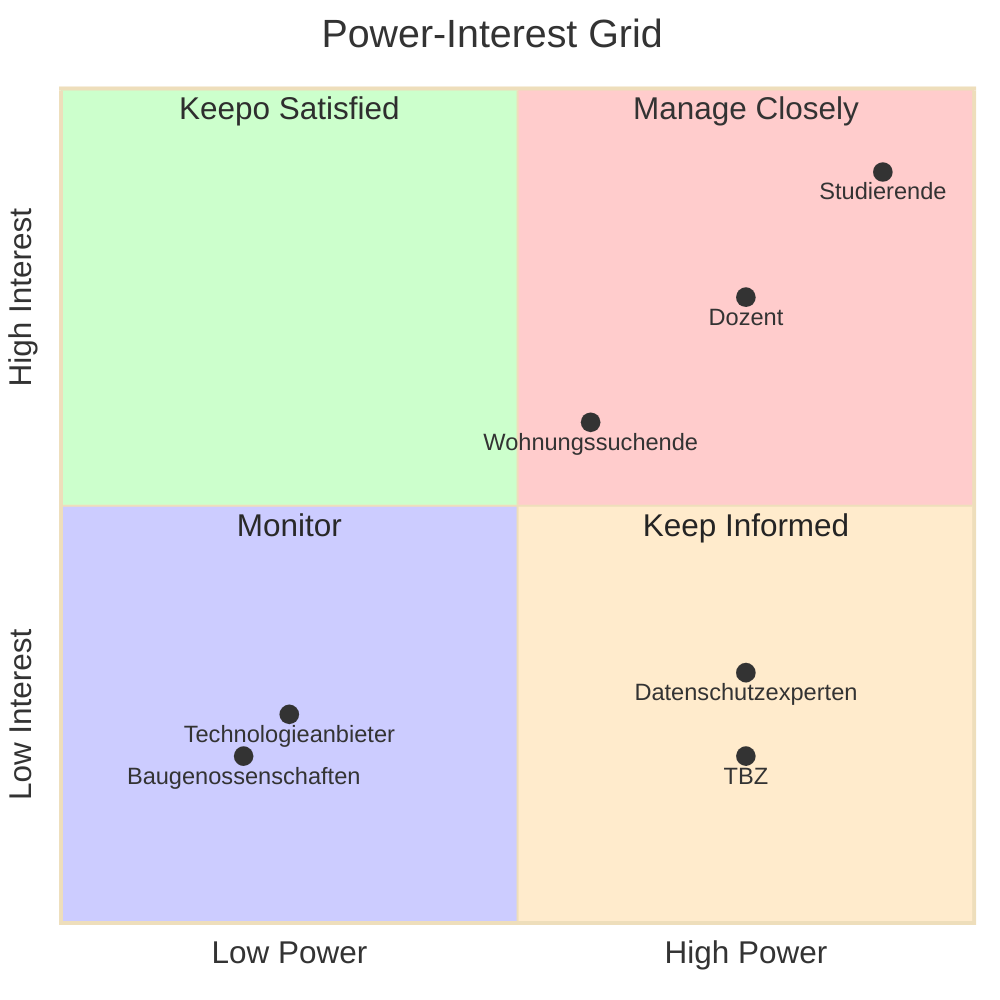

## Stakeholderanalyse

Die Stakeholderanalyse ist ein wichtiger Bestandteil des Projektmanagements, um die Interessen und Anforderungen der Beteiligten zu identifizieren und zu berücksichtigen.
In diesem Abschnitt werden die Stakeholder des Projekts identifiziert, analysiert und eine Strategie zur Einbindung entwickeln.

### 1. Identifikation der Stakeholder [^1]

| Stakeholder                    | Beschreibung                                                         |
|--------------------------------|----------------------------------------------------------------      |
| **Studierende (Dany Ambühl)**  | Hauptverantwortlicher für die Entwicklung und Umsetzung des Projekts.|
| **Begleitende Dozenten**        | Überwachen und unterstützen, genehmigen und bewerten die Arbeit.    |
| **Interessierte Wohnungssuchende** | Potenzielle Nutzer der entwickelten Plattform zur Wohnungssuche. |
| **Baugenossenschaften** | Bieten die Wohnungsdaten, sind an einer effizienten Vermittlung interessiert.|
| **Technische Berufsschule Zürich** | Institution, die die Semesterarbeit fördert und überwacht.       |
| **Technologieanbieter** | Stellen die technischen Werkzeuge und Plattformen zur Verfügung.            |
| **Datenschutz- und Sicherheitsexperten** | Beraten zu rechtlichen und sicherheitsrelevanten Aspekten. |

### 2. Analyse der Stakeholder [^2]

| Stakeholder                    | Interessen                                                    | Einfluss auf das Projekt  | Bedeutung für das Projekt |
|--------------------------------|----------------------------------------------------------------|--------------------------|---------------------------|
| **Studierende**                | Erfolgreiche Umsetzung, Lernerfahrung, gute Bewertung.         | Hoch                     | Hoch                      |
| **Begleitende Dozenten**       | Einhaltung der Projektziele, Qualität der Arbeit.              | Hoch                     | Hoch                      |
| **Wohnungssuchende**           | Zugang zu bezahlbarem Wohnraum                                 | Hoch                     | Mittel                    |
| **Baugenossenschaften**        | Effiziente Vermittlung von Wohnungen                           | Gering                   | Gering                    |
| **TBZ**                        | Erfolgreiche Durchführung der Projekte,                        | Hoch                     | Gering                    |
| **Technologieanbieter**        | Nutzung und Verbreitung ihrer Tools und Plattformen.           | Gering                   | Mittel                    |
| **Datenschutzexperten**        | Einhaltung von Datenschutzrichtlinien, Sicherheit.             | Mittel                   | Hoch                      |

### 3. Analyse der Stakeholder [^2]

### 4. Strategien zur Einbindung der Stakeholder

| Stakeholder                    | Kommunikationsstrategie                                        | Massnahmen zur Einbindung                       |
|--------------------------------|----------------------------------------------------------------|-------------------------------------------------|
| **Studierende**                | Regelmässige Selbstüberprüfung, Feedback einholen.             | Projektmanagement, Selbstreflexion.             |
| **Begleitender Dozent**        | Meetings, Fragen währen Unterricht.                            | Status-Meetings, Meilenstein-Sitzungen          |
| **Wohnungssuchende**           | Anforderungen abholen, Feature requests                        | Automatisches und Manuelles Testing, Umfrage.   |
| **Baugenossenschaften**        | Partnerschaften anbieten                                       | Kooperationsvereinbarungen                      |
| **TBZ**                        | Berichte, Evaluationen, Erfolgsgeschichten.                    | Semesterbericht, Erfolgsgeschichten teilen.     |
| **Technologieanbieter**        | Best Practices, Free-Tier verwenden.                           | Teilnahme an Webinar, Education Program verwenden |
| **Datenschutzexperten**        | Compliance-Bericht, Rechtliche Aspekte                         | Überprüfungen, mit lehrperson besprechen        |

### 5. Bewertung und Anpassung

| Kriterium                      | Bewertung (Skala 1-5) | Massnahmen zur Verbesserung               |
|--------------------------------|-----------------------|-------------------------------------------|
| **Einfluss der Stakeholder**   | 4                     | Regelmässige Überprüfung der Einbindung.   |
| **Interessenabgleich**         | 4                     | Engere Zusammenarbeit mit den Experten.   |
| **Kommunikationsstrategie**    | 3                     | Verbesserung der Feedbackmechanismen.   |
| **Projekterfolgspotential**    | 5                     | Kontinuierliche Evaluierung und Anpassung. |

### Quellen

[^1]: Identifikation der Stakeholder [Retrieved from](https://www.smartsheet.com/definitive-guide-stakeholder-management)
[^2]: Stakeholder Analysis [Retrieved from](https://www.mindtools.com/aol0rms/stakeholder-analysis)
[^3]: Stakeholder Mapping [Retrieved from](https://www.projectmanager.com/blog/stakeholder-mapping-guide)
