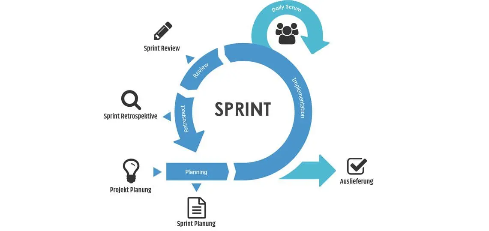

## Projektmethode

Dieses Projekt wird unter Anwendung der Scrum-Methode durchgeführt. Ein wesentlicher Grund für die Wahl von Scrum ist die hohe Flexibilität dieser Methodik. Durch die Aufteilung in mehrere Sprints sowie regelmässige Reviews, Retrospektiven und Planungsphasen bietet Scrum stets einen klaren Überblick über den Projektfortschritt. Darüber hinaus ermöglichen die häufigen Reviews, kontinuierlich auf das Feedback der Stakeholder einzugehen und entsprechende Anpassungen vorzunehmen.

## Scrum-Prozess

Die folgende Abbildung veranschaulicht die agile Projektmethode Scrum:

### Sprint

Ein Sprint ist das Herzstück von Scrum. Ein Sprint ist ein Zeitabschnitt von typischerweise zwei bis vier Wochen. Zum Sprint gehören folgende Abschnitte:

- Sprint Planning
- Daily Scrum
- Sprint Review
- Sprint Retrospektive

Diese Abschnitte unterstützen den Sprint und regeln den Ablauf und die Qualität.

### Sprint Planning

Das Sprint Planning ist ein wesentlicher Bestandteil des Sprints. Dabei werden Aufgaben vom Product Backlog in das aktuelle Sprint Backlog übernommen. Alle im Sprint Backlog befindlichen Tickets müssen innerhalb des Sprints bearbeitet werden.

### Daily Scrum [^1]

Beim Daily Scrum geht es um die Planung des Tags durch das Entwicklungsteam. Es geht um erledigte und offene Aufgaben, Hindernisse bei der Arbeit, und die Synchronisation.

- Was hae ich seit dem letzten Daily Scrum gemacht?
- Was plane ich bis zum nächsten Daily Scrum zu machen?
- Was halten mich davon ab, meine Arbeit zu erledigen?

Das Scrum Meeting is Timeboxed auf 15 Minuten, wird im stehen durchgeführt und wird danach beendet.

### Sprint Review [^2]

Das Sprint Review findet jeweils am Ende des Sprints statt. In diesem Meeting wird der Mehrwert des Sprints den Stakeholdern präsentiert. Es wird auch überprüft, ob alle Tasks im Sprint bearbeitet werden konnten.

### Sprint Retrospektive

Die Sprint Retrospektive ist ein Medium, in welchem sich das Scrum Team reflektieren kann. Jedes Teammitglied sollte etwas dazu beitragen. Kernpunkte in diesem Meeting sind:

- **Keep** Was soll beibehalten werden?
- **Drop** Mit was soll ich aufhören?
- **Try** Was soll ich im nächsten Sprint ausprobieren?

Das Ziel ist, kontinuierlich Verbesserungen im Prozess und in der Zusammenarbeit zu identifizieren und umzusetzen.

### Zusammenfassung der Phasen

Diese Phasen unterstützen den kontinuierlichen Fortschritt und die Qualitätssicherung innerhalb des Scrum-Prozesses.

| Aktivität                | Beschreibung                                                                                      |
|--------------------------|---------------------------------------------------------------------------------------------------|
| Sprint Planning          | Tasks vom Product Backlog ins Sprint Backlog verschieben                                          |
| Daily Scrum              | Regelmässiges kurzes Meeting zur Statusüberprüfung Beantwortung der Fragen: Was wurde gemacht, was sind die Probleme, was wird gemacht |
| Sprint Review            | Präsentation des Sprint-Mehrwerts an die Stakeholder Überprüfung der vollständigen Bearbeitung aller Tasks                     |
| Sprint Retrospektive     | Reflexion über den Sprint Identifikation von Verbesserungen                                   |

### Quellen

[^1]: Daily Scrum [Retrieved from](https://t2informatik.de/wissen-kompakt/daily-scrum/#:~:text=Beim%20Daily%20Scrum%20geht%20es%20um%20die%20Planung%20des%20Tags,der%20Lage%2C%20Ausk%C3%BCnfte%20zu%20geben.)

[^2]: Daily Review [Retrieved from](https://www.zoho.com/sprints/sprint-reviews.html#:~:text=A%20sprint%20review%20is%20a,enables%20them%20to%20provide%20feedback.)
