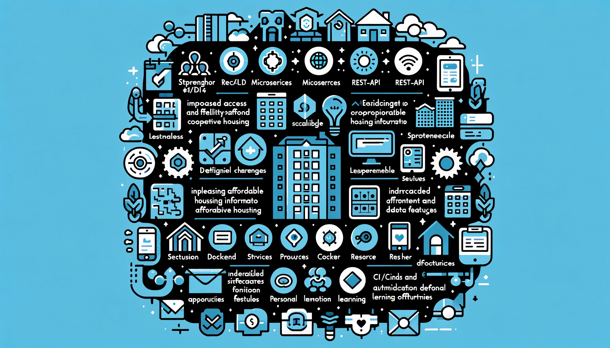

## SWOT-Analyse

 [^3]

### Stärken

1. **Nutzung moderner Technologien:**
   - Implementierung von Microservices und REST-API sorgt für Flexibilität und Skalierbarkeit.
   - Einsatz von CI/CD-Pipelines und Docker für effiziente und automatisierte Entwicklungs- und Deploy-Prozesse.

2. **Verbesserung des Zugangs zu Wohninformationen:**
   - Bietet detaillierte und aktuelle Informationen über verfügbare Genossenschaftswohnungen.
   - Integrierte Benachrichtigungsfunktionen halten Nutzer auf dem Laufenden.

3. **Benutzerfreundlichkeit und Mobilität:**
   - Konzipiert für einfache Nutzung auf Smartphones, erhöht die Zugänglichkeit und Benutzerfreundlichkeit.
   - Benutzerfreundliche Filterfunktionen erleichtern die Wohnungssuche.

### Schwächen

1. **Technische Herausforderungen:**
   - Möglicher Mangel an technischem Know-how für die Implementierung und Wartung der neuen Technologien.
   - Potenzielle Schwierigkeiten bei der Integration von Benachrichtigungsfunktionen in verschiedene Smartphone-Betriebssysteme.

2. **Ressourcenbegrenzungen:**
   - Begrenzte Zeit und Ressourcen für die Entwicklung und Testphasen.
   - Abhängigkeit von externen Datenquellen (Baugenossenschaften), die möglicherweise nicht immer zuverlässig sind.

### Chancen

1. **Erhöhung der Chancen auf bezahlbaren Wohnraum:**
   - Hilft den Nutzern, schneller und effizienter bezahlbaren Wohnraum zu finden.
   - Kann eine breite Nutzerbasis anziehen, die nach preiswerten Wohnlösungen sucht.

2. **Marktpotenzial und Erweiterung:**
   - Möglichkeit, das System auf andere Städte und Regionen auszudehnen.
   - Einführung zusätzlicher Dienstleistungen und Premium-Funktionen für zusätzliche Einnahmequellen.
   - Frontend- und Backend-Entwicklung können getrennt werden, um die Plattform für andere Anwendungen zu nutzen.

3. **Persönliche und berufliche Entwicklung:**
   - Förderung der eigenen Fähigkeiten und Kenntnisse im Umgang mit modernen Technologien und Projektmanagement.
   - Potenzial, eine bedeutende Lerngelegenheit und praktische Erfahrung zu bieten.

### Bedrohungen

1. **Rechtliche und sicherheitsbezogene Risiken:**
   - Strenge Datenschutz- und Sicherheitsanforderungen müssen eingehalten werden.
   - Mögliche rechtliche Herausforderungen beim Scrabbing von Webseiten.

2. **Konkurrenz:**
   - Bestehende Plattformen und Dienstleistungen könnten ähnliche Funktionen anbieten.
   - Neue Marktteilnehmer könnten in den Bereich eintreten und Wettbewerb verschärfen.

3. **Abhängigkeit von externen Faktoren:**
   - Verfügbarkeit und Aktualität der Daten von Baugenossenschaften.
   - Technologische Veränderungen und neue Anforderungen an die Plattform könnten zusätzlichen Aufwand erfordern.

## Strategien zur Nutzung der SWOT-Analyse

| Kategorie            | Maßnahmen                                                                                                  |
|----------------------|------------------------------------------------------------------------------------------------------------|
| **Stärken nutzen**   | - Implementierung der modernen Technologien, um eine flexible und skalierbare Plattform zu gewährleisten. - Die mobile Verfügbarkeit und Flexibilität hervorheben.                 |
| **Schwächen minimieren** | - Enge Zusammenarbeit mit Fachexperten zur Bewältigung technischer Herausforderungen. - Einsatz von bereits vorhandenen Technologien, die verschiedene Smartphone-Betriebssysteme unterstützen. |
| **Chancen ergreifen** | - Erweiterungsmöglichkeiten in andere Städte und Regionen evaluieren. - Fortlaufend dokumentieren, um meine Erfahrungen zu teilen und zu lernen.                                    |
| **Bedrohungen abwehren** | - Sicherstellen, dass alle Datenschutz- und Sicherheitsanforderungen erfüllt sind. - Plattform kontinuierlich anpassen, um wettbewerbsfähig zu bleiben.                          |

### Quellen

[^1]: SWOT Analysen How to[Retrieved from](https://asana.com/de/resources/swot-analysis)
[^2]: SWOT Analysen [Retrieved from](https://www.business-wissen.de/artikel/swot-analyse-so-wird-eine-swot-analyse-erstellt/)
[^3]: Image depicting the concept of SWOT [Generated by AI, OpenAI's DALL-E](https://openai.com/index/dall-e-2/)
