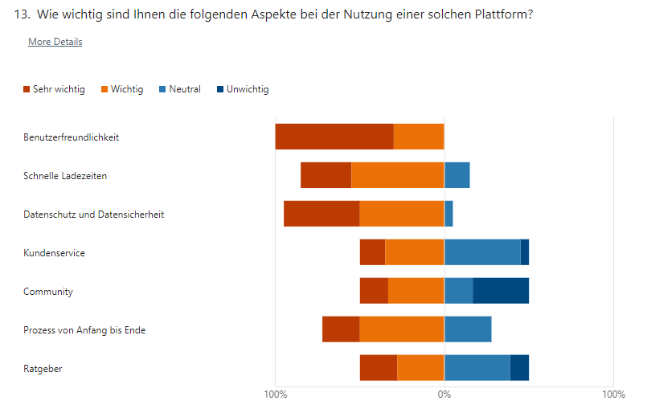

## Evaluation [^1]

Die Evaluation ist ein wichtiger Bestandteil des Projektmanagements, um die Interessen und Anforderungen der Beteiligten zu identifizieren und zu berücksichtigen.
Für die Evaluation des Projekts wurde eine Umfrage als Erhebungstechnik gewählt. Die Umfrage wird an potenzielle Nutzer der entwickelten Plattform zur Wohnungssuche gesendet.
Die Umfrage enthält Fragen zur Benutzerfreundlichkeit, Funktionalität und Anforderungen an solch eine Plattform.
Die Ergebnisse der Umfrage werden analysiert und in die Weiterentwicklung der Plattform verwendet.

## Erhebungstechnik Umfragemethodik

### Zielgruppe

Die Zielgruppe für die Umfrage umfasst potenzielle Nutzer der entwickelten Plattform zur Wohnungssuche, insbesondere Personen, die aktiv nach Genossenschaftswohnungen suchen oder in der Vergangenheit gesucht haben.
Dies schliesst eine breite demografische Gruppe ein, um vielfältige Meinungen und Anforderungen zu erfassen.

### Stichprobengrösse

Um repräsentative Ergebnisse zu erhalten, wird eine Stichprobengrösse von mindestens 20 Teilnehmern angestrebt.
Diese Grösse ermöglicht eine zuverlässige Analyse trotz eines Zeitlich sehr limitiertem Rahmen und hilft, aussagekräftige Rückschlüsse auf die Gesamtpopulation zu ziehen.

## Umfrage [^2]

Die Umfrage ist ein wichtiges Instrument zur Erhebung von Daten und Informationen. Sie ermöglicht es, die Meinungen, Einstellungen und Bedürfnisse der Befragten zu erfassen und auszuwerten.

[Zur Umfrage](https://forms.office.com/e/PR0WmSXgww?origin=lprLink){: .btn } [^5]

Die Fragen der Umfrage sind so formuliert, dass sie klar und verständlich sind. Sie sollten neutral und unvoreingenommen sein, um eine objektive Beurteilung zu ermöglichen.
Die Umfrage ist sehr kurz gehalten, um die Teilnehmer nicht zu überfordern. Die Fragen sind auf das Wesentliche reduziert und zielen darauf ab, die wichtigsten Informationen zu erhalten.

## Auswertung [^3] [^4]

Die Auswertung der Umfrage erfolgt nach Abschluss der Befragung. Die Ergebnisse werden analysiert und in einem Bericht zusammengefasst.
Die Erkenntnisse aus der Umfrage dienen als Grundlage für die Weiterentwicklung der Plattform zur Wohnungssuche.

Die Daten sind in Tabellenform in einer Excel-Datei verfügbar und können für die weitere Analyse verwendet werden.

[Ergebniss Umfrage Tabellenform](../../Wohnen_Baugenossenschaft_Umfrage.xlsx){: .btn }

Hier möchte ich nur kurz auf eine Grafische Darstellung der Ergebnisse eingehen.

[Ergebniss Umfrage Grafisch](https://forms.office.com/Pages/AnalysisPage.aspx?AnalyzerToken=v02nT8YI0fnO89YYO0KQbMzBfBndRPaK&id=xf0z91USjU23kyvHrKDyFD-TxWCORd5DpF5gn6qmMhNUQzZFREpWSDMzSkRFRU1FS1Y0OU8wQjMyRC4u){: .btn }

## Fazit der Umfrage

Die Umfrage hat die Anforderungen und Bedürfnisse der Zielgruppe erfasst und liefert wichtige Erkenntnisse für die Weiterentwicklung der Plattform zur Wohnungssuche.
Die Ergebnisse der Umfrage werden in die Weiterentwicklung der Plattform einbezogen und dienen als Grundlage für die Implementierung neuer Funktionen und Verbesserungen.

### Implementierung neuer Funktionen

Durch diese Auswertung kann ich die Bedürfnisse der Nutzer besser verstehen und die Plattform entsprechend anpassen. So das der Fokus des nächsten Issues auf eine Filterfunktion gelegt wird.
Ein weiterer Punkt sich von der Konkurrenz abzuheben ist die Implementierung von Informationen zur Bewerbungskriterien der Genossenschaften.

### Fokus Funktionalität und Datenschutz

Die Umfrage hat gezeigt, dass die Benutzerfreundlichkeit und die Funktionalität der Datenschutz wichtige Anforderungen sind.

### Quellen

[^1]: Erhebungstechniken [Retrieved from](https://www.orghandbuch.de/Webs/OHB/DE/Organisationshandbuch/6_MethodenTechniken/61_Erhebungstechniken/613_Fragebogen/fragebogen-node.html)
[^2]: Best Practice Fragen [Retrieved from](https://de.surveymonkey.com/learn/survey-best-practices/online-questionnaires/)
[^3]: Umfrage Auswertung [Retrieved from](https://www.umfrageonline.com/de/umfrage-auswerten)
[^4]: Umfrage Analyse [Retrieved from](https://www.umfrageonline.com/de/umfrage-analyse)
[^5]: Forms Office [Retrieved from](https://www.microsoft.com/de-de/microsoft-365/business/forms)
