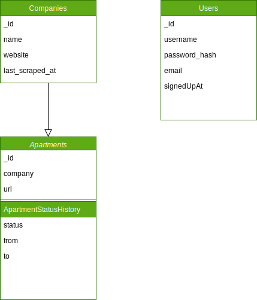

## Evaluation Datenbank

Die Wahl der richtigen Datenbank für mein Projekt ist von grosser Bedeutung.
In diesem Abschnitt werde ich die Vor- und Nachteile von MongoDB und MySQL vergleichen, um eine nachvollziehbare Entscheidung für die beste Datenbankwahl für mein Projekt zu treffen.
Am Ende werde ich eine Entscheidungsmatrix erstellen, um die verschiedenen Kriterien zu bewerten und eine endgültige Entscheidung zu treffen.

Damit ich einen Überblick über die Datenbanken habe, erstelle ich zuerst ein Datenbankschema für beide Datenbanken.

## DB Schema MongoDB

Im MongoDB Schema habe ich die Möglichkeit genutzt, die Datenbankstruktur flexibel zu gestalten.
So konnte ich die Collection 'ApartmentStatusHistory' in der Collection 'Apartment' einbetten, um die Historie der Statusänderungen eines Apartments zu speichern.



<details markdown="block">
<summary>JSON Mongo DB Schema</summary>

### Collection Companies

```c
{
    "_id": MongoDB ObjectId,
    "name": String, // Name des Unternehmens
    "website": String, // Webseite des Unternehmens 
    "last_scraped_at": Date, // Datum und Uhrzeit, wann die Webseite zuletzt gescraped wurde
    "contact": { // Kontaktinformationen
        "phone": String, // Telefonnummer (falls vorhanden)
        "email": String, // E-Mail Adresse (falls vorhanden)
        "address": String, // Büroadresse (falls vorhanden)
    },
    "status": String, // Status der Webseite, z.B. 'aktiv', 'inaktiv' etc.
}
```

### Collection Apartments & ApartmentStatusHistory

```c
{
    "_id": MongoDB ObjectId,
    "company": MongoDB ObjectId, // Referenz auf das Immobilienunternehmen
    "url": String,  // URL der Webseite, von der die Wohnung gescraped wurde
    "details": { // Details der Wohnung
        "address": String, // Adresse der Wohnung
        "rooms": Number, // Anzahl der Zimmer
        "availableFrom": Date, // Verfügbar ab (falls vorhanden)
        "price": Number, // Preis der Wohnung (falls vorhanden)
        "size": Number, // Grösse der Wohnung in Quadratmetern (falls vorhanden)
        "floor": Number, // Stockwerk (falls vorhanden)
        "otherDetails": String, // Andere Information über die Wohnung (falls vorhanden)
    },
    "hash": String, // Hash des HTML-Inhalts
    "scraped_at": Date, // Datum und Uhrzeit, wann die Wohnung gescraped wurde
    "status": String, // Status der Wohnung, z.B. 'frei', 'vermietet' etc.
    "historicStatus": [  // Speichert die Historie des Status der Wohnung
        { 
            "status": String, 
            "from": Date, 
            "to": Date 
        }
    ]
}

```

### Collection Users

```c
{
    "_id": MongoDB ObjectId,
    "username": String, // Benutzername
    "password_hash": String, // Passworthash
    "email": String, // E-Mail-Adresse des Benutzers
    "signedUpAt": Date, // Datum und Uhrzeit, wann der Benutzer sich angemeldet hat
    "preferences": { // Speichert die Benutzereinstellungen und Präferenzen
        "priceRange": { "min": Number, "max": Number }, // Preisbereich
        "roomRange": { "min": Number, "max": Number }, // Zimmeranzahl
    }
}

```

</details>

## DB Schema MySQL

Im MySQL Schema habe ich die Datenbankstruktur starrer gestaltet, um die Beziehungen zwischen den Tabellen zu definieren.
So habe ich die Tabellen 'apartment' und 'apartment_status_history' getrennt, um die Historie der Statusänderungen eines Apartments zu speichern.
Das Diagramm wurde mit PlantUML erstellt, leider kann Github PlantUML nicht direkt darstellen daher habe ich den umweg über die PlantUML Proxy Server gemacht.


[SQL Schema](../02_Plannung/sql_schema.iuml){: .btn }

## Vergleich [^1] [^2]
 
Um die Datenbanken zu vergleichen, werde ich die folgenden Kriterien verwenden:

### Performance

Die Performance kann sich je nach Einsatzszenario stark unterscheiden. MongoDB kann bei grossen Datenmengen und einfachen Anfragen oft schneller sein. MySQL ist jedoch bei komplexen Anfragen oft performanter, da die relationale Datenstruktur eine effizientere Datenmanipulation ermöglicht.

### Skalierbarkeit

MongoDB wurde für horizontale Skalierbarkeit entwickelt und kann leicht auf mehrere Maschinen verteilt werden. MySQL hingegen ist eher für vertikale Skalierbarkeit optimiert und kann daher bei grossen Datenmengen oder hoher Zugriffsrate an seine Grenzen stossen.

### Datenschema

Ein wesentlicher Unterschied zwischen MongoDB und MySQL ist der Umgang mit Datenschemas. MongoDB verwendet ein flexibles, JSON-ähnliches Format (BSON), das es erlaubt, strukturierte, halb-strukturierte und unstrukturierte Daten zu speichern. MySQL hingegen verwendet ein starres relationales Schema, das die Datenorganisation vorab definiert und Änderungen an der Struktur schwieriger macht.

### ACID-Transaktionen

Obwohl MongoDB in neueren Versionen Transaktionen unterstützt, ist MySQL in der Regel besser geeignet für Anwendungen, die komplexe Transaktionen mit mehreren Operationen erfordern.

### Community und Support

MySQL hat eine lange Geschichte und eine grosse aktive Community, während MongoDB eine jüngere Technologie mit einer wachsenden Community ist. Beide haben professionellen Support von den jeweiligen Unternehmen.

## Entscheidungsmatrix [^3]

Um die beiden Datenbanken zu bewerten, erstelle ich eine Entscheidungsmatrix mit den oben genannten Kriterien und gewichte sie entsprechend ihrer Bedeutung für mein Projekt.

| **Datenbank**  (1-5)  | **Performance**    | **Skalierbarkeit**  | **Flexibilität des Datenschemas** | **ACID-Transaktionen**  | **Community und Support**      | **Gesamtpunktzahl**  |
|---------------------  |------------------  |---------------------|---------------                    | --------------          | -----------------------------  | -------------------- |
| Gewichtung            | 0.3                | 0.1                 | 0.1                               | 0.3                     |   0.3                          |                      |
| MongoDB               | 3                  | 4                   | 4                                 | 3                       |   3                            | **3.5**              |
| MySQL                 | 4                  | 2                   | 2                                 | 5                       |   4                            | **4.3**              |

## Fazit

Beide Datenbanken haben ihre Vor- und Nachteile und eignen sich für unterschiedliche Anwendungsfälle.
Anhand der Entscheidungsmatrix lässt sich jedoch feststellen, dass MySQL insgesamt besser abschneidet und daher die bessere Wahl für mein Projekt ist.

### Quellen

[^1]: SQL Mongo DB Vergleich [Retrieved from](https://www.ionos.de/digitalguide/server/knowhow/mongodb-vs-sql/)
[^2]: SQL Mongo DB Vergleich [Retrieved from](https://www.ionos.de/digitalguide/hosting/hosting-technik/mysql-vs-mongodb/)
[^3]: Entscheidungsmatrix [Retrieved from](https://de.wikipedia.org/wiki/Entscheidungsmatrix)
