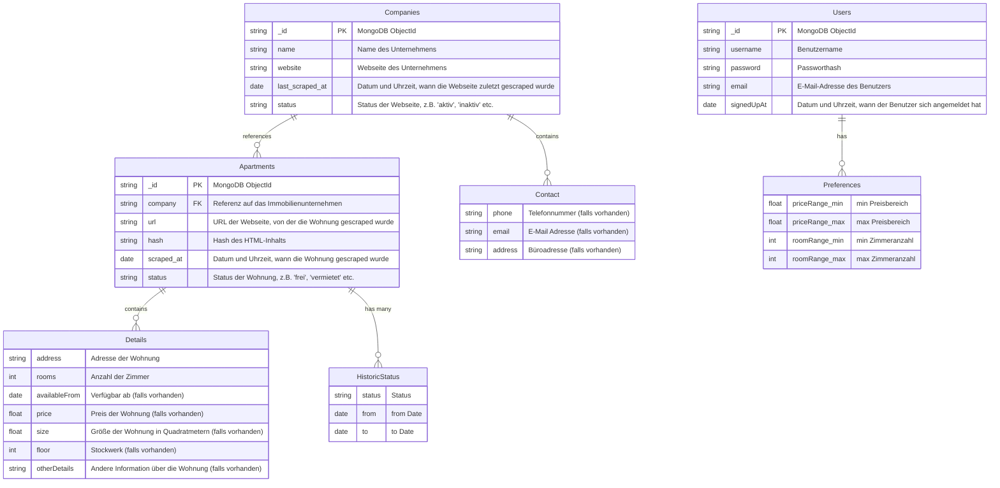

## Evaluation Datenbank

Die Wahl der richtigen Datenbank für Ihr Projekt ist von entscheidender Bedeutung.
In diesem Abschnitt werde ich die Vor- und Nachteile von MongoDB und MySQL vergleichen, um die beste Wahl für Ihr Projekt zu treffen werde ich am ende eine Entscheidungsmatrix erstellen

Damit ich einen Überblick über die Datenbanken habe, erstele ich zuerst ein Datenbankschema für beide Datenbanken.

## DB Schema MongoDB

[![](https://mermaid.ink/img/pako:eNqlVktu2zAQvQqhTVrAzgG8i-O0MRq3aRK3QGHAGIsjiY1ICiRlN3Jylt6iq-x8sQ4ly3Zs-QNEC4mi3pvhzLyhOA9CzTHoBGh6AmIDcqQYXZdaZqAEWvb83G7rObvIwDiJylnWYaPAYIQGVYh2FOxhXGrlIHQlPPRjoVbgDWtLdA8JkNoT0dfCOm1EeO_A5RUpAcskqKeaNLRoVvjb9XprsMdtr3xeTfjLOiNUzMaCs9svxBhoFetel32b_MbQ9XntZgOrQCIhv_oHJ2tD5dAoTGjltgE-w4kVzjN-0gj98BCLAwFSsG5sQwMZ8jE44vYoAZLlirNhYgqy0mIzUIpxgWxlt8hTdIVjMS65bJYbjg2LslVCR8EysxzNykyLFefdc3YGj05Mz1rsTKhqyNCF57Wxl3Vaq_rvJjVLtPJxP2CKkVYql5LcfIggJQFMtUlAcVQfG5aHkkRCzKv2wA8uuEFr8SQq8BJM5O7i1Wg4Rl3FsaG-9-kjLHX2xD55_F0lyIJBHlFtLetLqSciFajytQIarOTGJ2B4d7NVm6lW5UxZeJ2QlfiEelMjJGTu2j-8-q4fBjftvkogdbvqO114J_tv1FvFruUWGRRebVM0UqBDt0dv9Q4yP1D6WjAbbjYXJZRjRmtZQlUBSVoifwkv0J10wJT8wSTFT0ZLYvxAEy1e4wkYBpPDmoxSTUnMaAfzfUC7k3gT-ilkKwrP_WwW_xZ_30REYbDvOQkcSLZeSofN-aDJpDZlFXT4OEPzeFJLaZfQb2OZdp8xWgSyvoq0keAECXLxOtmS5PF-29rb58c0s1OXqCpH-SCV4g7AafpMt82PK_fVf-N9nZ6TjeXfoEv97IrqtQGZgbUzbbhXQTV0viWPbn3ttZItq300dKyIFfJhdnGwY6lEtQlihAkDFaPElKOjDcLtpGjzbzpvFPWdtzCWJMRR4O-lwkkKSNb39MGSAn88he77KHWPbruomhTKrj2AX9lvwlOEQSugaco1p0NRGRxJJUFfPH9w4BhBnpYpeSEo5E7fP6kw6DiTYyvIM5_25Unq7eQVFyTroEP6tzSJ5eugOnyVZ7CX_3cPJos?type=png)](https://mermaid-live-editor.fly.dev/edit#pako:eNqlVktu2zAQvQqhTVrAzgG8i-O0MRq3aRK3QGHAGIsjiY1ICiRlN3Jylt6iq-x8sQ4ly3Zs-QNEC4mi3pvhzLyhOA9CzTHoBGh6AmIDcqQYXZdaZqAEWvb83G7rObvIwDiJylnWYaPAYIQGVYh2FOxhXGrlIHQlPPRjoVbgDWtLdA8JkNoT0dfCOm1EeO_A5RUpAcskqKeaNLRoVvjb9XprsMdtr3xeTfjLOiNUzMaCs9svxBhoFetel32b_MbQ9XntZgOrQCIhv_oHJ2tD5dAoTGjltgE-w4kVzjN-0gj98BCLAwFSsG5sQwMZ8jE44vYoAZLlirNhYgqy0mIzUIpxgWxlt8hTdIVjMS65bJYbjg2LslVCR8EysxzNykyLFefdc3YGj05Mz1rsTKhqyNCF57Wxl3Vaq_rvJjVLtPJxP2CKkVYql5LcfIggJQFMtUlAcVQfG5aHkkRCzKv2wA8uuEFr8SQq8BJM5O7i1Wg4Rl3FsaG-9-kjLHX2xD55_F0lyIJBHlFtLetLqSciFajytQIarOTGJ2B4d7NVm6lW5UxZeJ2QlfiEelMjJGTu2j-8-q4fBjftvkogdbvqO114J_tv1FvFruUWGRRebVM0UqBDt0dv9Q4yP1D6WjAbbjYXJZRjRmtZQlUBSVoifwkv0J10wJT8wSTFT0ZLYvxAEy1e4wkYBpPDmoxSTUnMaAfzfUC7k3gT-ilkKwrP_WwW_xZ_30REYbDvOQkcSLZeSofN-aDJpDZlFXT4OEPzeFJLaZfQb2OZdp8xWgSyvoq0keAECXLxOtmS5PF-29rb58c0s1OXqCpH-SCV4g7AafpMt82PK_fVf-N9nZ6TjeXfoEv97IrqtQGZgbUzbbhXQTV0viWPbn3ttZItq300dKyIFfJhdnGwY6lEtQlihAkDFaPElKOjDcLtpGjzbzpvFPWdtzCWJMRR4O-lwkkKSNb39MGSAn88he77KHWPbruomhTKrj2AX9lvwlOEQSugaco1p0NRGRxJJUFfPH9w4BhBnpYpeSEo5E7fP6kw6DiTYyvIM5_25Unq7eQVFyTroEP6tzSJ5eugOnyVZ7CX_3cPJos)

## DB Schema MySQL

## Vergleich

Um die Datenbanken zu vergleichen, werde ich die folgenden Kriterien verwenden:

### Performance

Die Performance kann sich je nach Einsatzszenario stark unterscheiden. MongoDB kann bei großen Datenmengen und einfachen Anfragen oft schneller sein. MySQL ist jedoch bei komplexen Anfragen oft performanter, da die relationale Datenstruktur eine effizientere Datenmanipulation ermöglicht.

### Skalierbarkeit

MongoDB wurde für horizontale Skalierbarkeit entwickelt und kann leicht auf mehrere Maschinen verteilt werden. MySQL hingegen ist eher für vertikale Skalierbarkeit optimiert und kann daher bei großen Datenmengen oder hoher Zugriffsrate an seine Grenzen stoßen.

### Datenschema

Ein wesentlicher Unterschied zwischen MongoDB und MySQL ist der Umgang mit Datenschemas. MongoDB verwendet ein flexibles, JSON-ähnliches Format (BSON), das es erlaubt, strukturierte, halb-strukturierte und unstrukturierte Daten zu speichern. MySQL hingegen verwendet ein starres relationales Schema, das die Datenorganisation vorab definiert und Änderungen an der Struktur schwieriger macht.

## ACID-Transaktionen

Obwohl MongoDB in neueren Versionen Transaktionen unterstützt, ist MySQL in der Regel besser geeignet für Anwendungen, die komplexe Transaktionen mit mehreren Operationen erfordern.

## Community und Support

MySQL hat eine lange Geschichte und eine große aktive Community, während MongoDB eine jüngere Technologie mit einer wachsenden Community ist. Beide haben professionellen Support von den jeweiligen Unternehmen.

## Entscheidungsmatrix

| **Datenbank**  (1-5)  | **Performance**    | **Skalierbarkeit**  | **Flexibilität des Datenschemas** | **ACID-Transaktionen**  | **Community und Support**      | **Gesamtpunktzahl**  |
|---------------------  |------------------  |---------------------|---------------                    | --------------          | -----------------------------  | -------------------- |
| Gewichtung            | 0.3                | 0.1                 | 0.15                              | 0.2                     |   0.2                          | 
| MongoDB               | 4                  | 4                   | 4                                 | 3                       |   3                            | 3.4             |
| MySQL                 | 3                  | 2                   | 2                                 | 5                       |   4                            | 

Berechnen der Gesamtpunktzahl (Summe aus gewichteten Punkten für jedes Kriterium):

MongoDB: 0.3 * 4 (Performance) + 0.25 * 4 (Skalierbarkeit) + 0.15 * 5 (Datenschema) + 0.2 * 3 (ACID) + 0.1 * 4 (Support) = 4.05

In diesem szenario wäre MongoDB die geeignete Wahl basierend auf der höheren Gesamtpunktzahl
