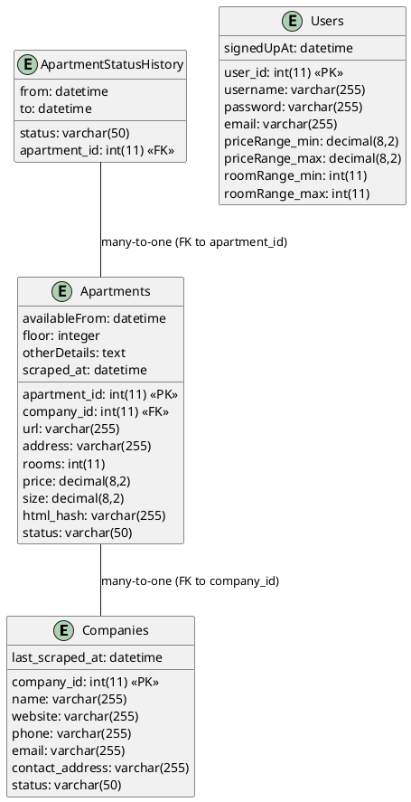

Das ist eine kluge Entscheidung. Es ist immer vorteilhaft, eine Evaluierung vor der Entscheidungsfindung durchzuführen. Hier ist eine Art und Weise, wie Sie MongoDB und MySQL vergleichen könnten:

Datenschema: Ein wesentlicher Unterschied zwischen MongoDB und MySQL ist der Umgang mit Datenschemas. MongoDB verwendet ein flexibles, JSON-ähnliches Format (BSON), das es erlaubt, strukturierte, halb-strukturierte und unstrukturierte Daten zu speichern. MySQL hingegen verwendet ein starres relationales Schema, das die Datenorganisation vorab definiert und Änderungen an der Struktur schwieriger macht.

## DB Schema MongoDB

### Collection Companies

```json
{
    "_id": MongoDB ObjectId,
    "name": String, // Name des Unternehmens
    "website": String, // Webseite des Unternehmens 
    "last_scraped_at": Date, // Datum und Uhrzeit, wann die Webseite zuletzt gescraped wurde
    "contact": { // Kontaktinformationen
        "phone": String, // Telefonnummer (falls vorhanden)
        "email": String, // E-Mail Adresse (falls vorhanden)
        "address": String, // Büroadresse (falls vorhanden)
    },
    "status": String, // Status der Webseite, z.B. 'aktiv', 'inaktiv' etc.
}
```

### Collection Apartments

```json
{
    "_id": MongoDB ObjectId,
    "company": MongoDB ObjectId, // Referenz auf das Immobilienunternehmen
    "url": String,  // URL der Webseite, von der die Wohnung gescraped wurde
    "details": { // Details der Wohnung
        "address": String, // Adresse der Wohnung
        "rooms": Number, // Anzahl der Zimmer
        "availableFrom": Date, // Verfügbar ab (falls vorhanden)
        "price": Number, // Preis der Wohnung (falls vorhanden)
        "size": Number, // Größe der Wohnung in Quadratmetern (falls vorhanden)
        "floor": Number, // Stockwerk (falls vorhanden)
        "otherDetails": String, // Andere Information über die Wohnung (falls vorhanden)
    },
    "hash": String, // Hash des HTML-Inhalts
    "scraped_at": Date, // Datum und Uhrzeit, wann die Wohnung gescraped wurde
    "status": String, // Status der Wohnung, z.B. 'frei', 'vermietet' etc.
    "historicStatus": [  // Speichert die Historie des Status der Wohnung
        { 
            "status": String, 
            "from": Date, 
            "to": Date 
        },
        //...
    ]
}

```

### Collection Users

```json
{
    "_id": MongoDB ObjectId,
    "username": String, // Benutzername
    "password": String, // Passworthash
    "email": String, // E-Mail-Adresse des Benutzers
    "signedUpAt": Date, // Datum und Uhrzeit, wann der Benutzer sich angemeldet hat
    "preferences": { // Speichert die Benutzereinstellungen und Präferenzen
        "priceRange": { "min": Number, "max": Number }, // Preisbereich
        "roomRange": { "min": Number, "max": Number }, // Zimmeranzahl
        // Weitere Präferenzen...
    }
}

```

DB Schema MySQL



Unbenützte docker image löschen

```bash
docker image ls
docker image prune
```


Skalierbarkeit: MongoDB wurde für horizontale Skalierbarkeit entwickelt und kann leicht auf mehrere Maschinen verteilt werden. MySQL hingegen ist eher für vertikale Skalierbarkeit optimiert und kann daher bei großen Datenmengen oder hoher Zugriffsrate an seine Grenzen stoßen.

Performance: Die Performance kann sich je nach Einsatzszenario stark unterscheiden. MongoDB kann bei großen Datenmengen und einfachen Anfragen oft schneller sein. MySQL ist jedoch bei komplexen Anfragen oft performanter, da die relationale Datenstruktur eine effizientere Datenmanipulation ermöglicht.

Transaktionen: Obwohl MongoDB in neueren Versionen Transaktionen unterstützt, ist MySQL in der Regel besser geeignet für Anwendungen, die komplexe Transaktionen mit mehreren Operationen erfordern.

Community und Support: MySQL hat eine lange Geschichte und eine große aktive Community, während MongoDB eine jüngere Technologie mit einer wachsenden Community ist. Beide haben professionellen Support von den jeweiligen Unternehmen.

Es ist wichtig zu betonen, dass weder MongoDB noch MySQL in allen Situationen die beste Wahl ist. Es hängt stark von den spezifischen Anforderungen des Projekts ab. Daher wäre es ratsam, für Ihr Projekt konkrete Szenarios zu testen und dabei zu überlegen, welche Aspekte für Ihr Projekt besonders relevant sind.

## Entscheidungsmatrix

| **Datenbank**  (1-5)  | **Performance**    | **Skalierbarkeit**  | **Flexibilität des Datenschemas** | **ACID-Transaktionen**  | **Community und Support**      | **Gesamtpunktzahl**  |
|---------------------  |------------------  |---------------------|---------------                    | --------------          | -----------------------------  | -------------------- |
| Gewichtung            | 0.3                | 0.1                 | 0.15                              | 0.2                     |   0.2                          | 
| MongoDB               | 4                  | 4                   | 4                                 | 3                       |   3                            | 3.4             |
| MySQL                 | 3                  | 2                   | 2                                 | 5                       |   4                            | 


Berechnen der Gesamtpunktzahl (Summe aus gewichteten Punkten für jedes Kriterium):

MongoDB: 0.3 * 4 (Performance) + 0.25 * 4 (Skalierbarkeit) + 0.15 * 5 (Datenschema) + 0.2 * 3 (ACID) + 0.1 * 4 (Support) = 4.05

In diesem szenario wäre MongoDB die geeignete Wahl basierend auf der höheren Gesamtpunktzahl
