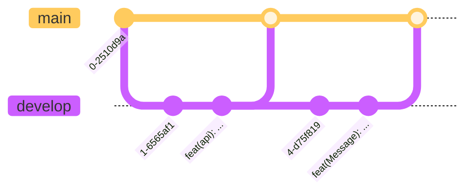

## Warum ein Git Branching-Konzept verwenden? [^1]

Git-Branches ermöglichen es Entwicklern, isolierte Umgebungen für Experimente und Entwicklung zu schaffen.
Wenn Sie an einer neuen Funktion oder einem Hotfix arbeiten, können Sie einen von der Codebasis getrennten branch erstellen.
Durch diese Isolierung wird sichergestellt, dass Änderungen, die in dem branch vorgenommen werden, die Stabilität des Hauptprojekts nicht beeinträchtigen, bis sie gründlich getestet und für die Integration bereit sind.

Dies gewährleistet eine parallele Entwicklung, so dass sich jeder Entwickler auf die ihm zugewiesene Aufgabe konzentrieren kann, ohne die Aufgaben anderer zu beeinträchtigen.

### GIT-Branching-Konzept [^2]

Dieses Projekt verwendet eine Git-Branching-Konzept mit zwei branches, einem main und einem Entwicklung branch.
Der main ist der produktive branch des Projekts und enthält alle Dateien, die in der Produktion benötigt werden und befindet sich immer in einem Arbeitszustand.
Er wird nur durch einen Pull-Request aus dem Develop-branch mit getesteten und genehmigten Änderungen aktualisiert.

Der Develop-branch wird für das Testen neuer Funktionen verwendet. Sobald eine Änderung getestet und genehmigt wurde, kann sie per Pull-Request in den Master-branch eingefügt werden.

### GIT-Branching-Konzept Abbildung

## Git Commands [^3]

**Einen neuen branch erstellen**

`git branch <branch-name>`

**Zum neuen branch wechseln**

`git checkout <branch-name>`

**Erstellen Sie einen neuen branch und direkt wechseln**

`git checkout -b <branch-name>`

**Alle branch auflisten**

`git branch`

**Einen branch mit dem aktiven branch zusammenführen**

`git merge <branch-name>`

**Einen Branch löschen**

`git branch -d <branch-name>`

## Quellen und Referenzen:

[^1]: Git best Practice (n.d.). [Retrieved from](https://www.gitkraken.com/learn/git/best-practices/git-branch-strategy)
[^2]: Git Branching] (n.d.). [Retrieved from](https://www.atlassian.com/git/tutorials/using-branches)
[^3]: Learn how to git branch [Retrieved from](https://learngitbranching.js.org/)
