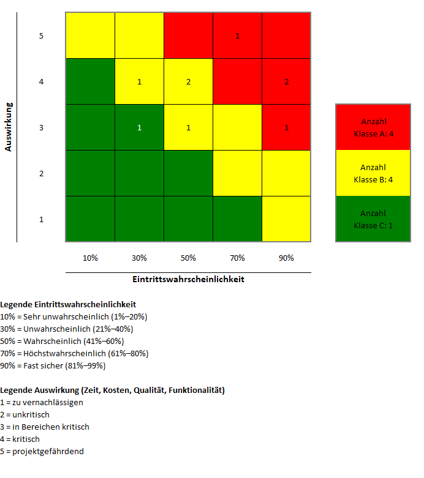
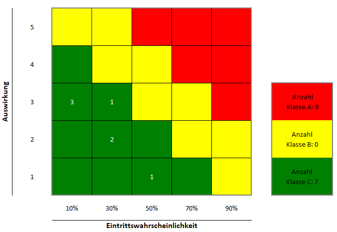
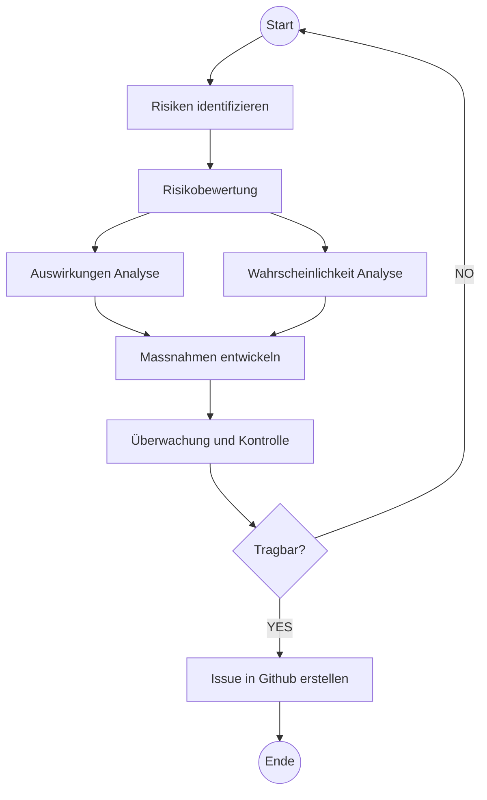

## Risikoanalyse [^1]

Die Risikoanalyse ist ein Prozess, bei dem potenzielle Risiken identifiziert, analysiert und bewertet werden, um die Wahrscheinlichkeit ihres Auftretens und ihre Auswirkungen auf ein Projekt zu bestimmen. Ziel ist es, Risiken zu minimieren und die Wahrscheinlichkeit eines erfolgreichen Projektabschlusses zu erhöhen.

Es wurde das hier verlinkte Risikomanagement-Tool verwendet, um die Risiken zu identifizieren, zu bewerten und Massnahmen zur Risikominimierung zu definieren.

[Risikomanagement-Tool](Kap8_Risikomanagement_Tool.xlsm){: .btn }

### Risikoliste [^2]

| ID | Risiko | Beschreibung | Wahrscheinlichkeit | Auswirkung 1-5 | 
|--------|--------|--------------|--------------------|------------|
| 1 | Zeitplan nicht eingehalten | Der Zeitplan wird nicht eingehalten, was zu Verzögerungen und zusätzlichen Kosten führt. | 70 % | 5 |
| 2 | Technische Probleme | Technische Probleme treten auf, die die Funktionalität des Projekts gefährden. | 90 % | 4 |
| 3 | Umfangserweiterung | Das Projekt kann Verzögerungen erleiden, wenn der Umfang unerwartet erweitert wird oder technische Herausforderungen auftreten. | 90 % | 4 |
| 4 | Benachrichtigungen über neue Angebote | Benachrichtigungen über neue Angebote können versehentlich ausgelöst werden und Benutzer verärgern | 50 % | 3 |
| 5 | Verfügbare Daten | Es stehen nicht genügend Daten zur Verfügung, um die Funktionalität des Projekts zu gewährleisten. | 30 % | 4 |
| 6 | Datenschutzverletzung | Es besteht das Risiko, dass das web scraping von Daten auf den Genossenschaftswohnungen unerlaubt ist oder verhindert wird | 50% | 4 |
| 7 | Benutzerfreundlichkeit | Die Benutzerfreundlichkeit der Plattform entspricht nicht den Erwartungen der Benutzer. | 50 % | 4 |
| 8 | Performance-Probleme | Die Plattform ist langsam oder instabil, was zu einer schlechten Benutzererfahrung führt. | 30 % | 3 |
| 9 | Missverständnisse bei der Anforderungsdefinition | Missverständnisse bei der Anforderungsdefinition können zu Fehlern führen. | 90 % | 3 |

### Risikomatrix vor Massnahmen

Die Risikomatrix ist ein Instrument zur Bewertung und Visualisierung von Risiken anhand ihrer Eintrittswahrscheinlichkeit und ihrer Auswirkung auf das Projekt. Risiken werden in der Matrix entsprechend ihrer Position in den Kategorien "gering", "mittel" und "hoch" eingestuft.

### Massnahmen zur Risikominimierung [^3]

| ID | Risiko | Massnahmen | Wahrscheinlichkeit | Auswirkung |
|--------|--------|--------------|--------------------|------------|
| 1 | Zeitplan nicht eingehalten | Gutes Projektmanagement und regelmässige Überprüfung des Zeitplans, um Verzögerungen frühzeitig zu erkennen und zu beheben       | 10 % | 3 |
| 2 | Technische Probleme       | Regelmässige Tests und Feedback von Experte, um technische Probleme frühzeitig zu erkennen und zu beheben.                        | 30% | 2 |
| 3 | Umfangserweiterung        | Klare Definition des Projektumfangs und regelmässige Überprüfung, um unerwartete Erweiterungen zu vermeiden.                      | 50 % | 1 |
| 4 | Benachrichtigungen über neue Angebote | Implementierung von Tests und Überwachung, um versehentliche Benachrichtigungen zu vermeiden.                         | 10 % | 3 |
| 5 | Verfügbare Daten          | Frühzeitig prüfen, dass ausreichend Daten verfügbar sind, um die Funktionalität des Projekts zu gewährleisten.                    | 0 % | 0 |
| 6 | Datenschutzverletzung     | Informieren zu Datenschutzrichtlinien, um das Risiko einer Datenschutzverletzung zu minimieren und Zugriffe Variable gestalten                                   | 30 % | 2 |
| 7 | Benutzerfreundlichkeit    | Evaluation von Erwartungen und Tests, um die Benutzerfreundlichkeit der Plattform zu verbessern.                                  | 10% | 2 |
| 8 | Performance-Probleme      | Detaillierte Evaluation der richtigen Datenbank und Überwachung der Performance, um Performance-Probleme zu minimieren.           | 10% | 3 |
| 9 | Missverständnisse bei der Anforderungsdefinition | Durchführen einer Stakeholderanalyse und Überprüfung der Anforderungen, um Missverständnisse zu vermeiden. | 0 | 0 |

### Risikomatrix nach Massnahmen

Nach der Implementierung von Massnahmen zur Risikominimierung werden die Risiken erneut bewertet und in der Risikomatrix neu positioniert. Ziel ist es, die Eintrittswahrscheinlichkeit und die Auswirkung der Risiken zu reduzieren und das Risikopotenzial des Projekts zu minimieren.

### Fortschrittsverfolgung der Massnahmen

Die Massnahmen werden in Github als Issues erfasst und mit den entsprechenden Risiken verknüpft. Der Status der Massnahmen wird regelmässig überprüft und aktualisiert, um den Fortschritt zu dokumentieren und sicherzustellen, dass die Risiken kontrolliert und minimiert werden.

### Risikomanagement Prozess

### Fazit

Die Risikoanalyse und das Risikomanagement sind wichtige Instrumente zur Identifikation, Bewertung und Minimierung von Risiken in einem Projekt. Durch die systematische Analyse und Bewertung von Risiken können potenzielle Probleme frühzeitig erkannt und Massnahmen zur Risikominimierung definiert werden. Die regelmässige Überwachung und Kontrolle der Risiken ermöglicht es, das Risikopotenzial des Projekts zu minimieren und die Wahrscheinlichkeit eines erfolgreichen Projektabschlusses zu erhöhen.

### Referenzen

[^1]: Kompetenz Risikomanagement [Retrieved from](https://gitlab.com/ch-tbz-wb/Stud/prj/-/tree/main/2_Unterrichtsressourcen/F_RisikoManagement)
[^2]: Risikoanalyse How to [Retrieved from](https://www.theprojectgroup.com/blog/risikomanagement-im-projektmanagement/#:~:text=Wann%20macht%20man%20eine%20Risikoanalyse,im%20gesamten%20Projektverlauf%20wiederholt%20wird.)
[^3]: Risikobewertung [Retrieved from](https://regina-stoiber.com/2019/04/28/risikoanalyse-durchfuehren-mit-muster-vorlage-und-beispiel/)
