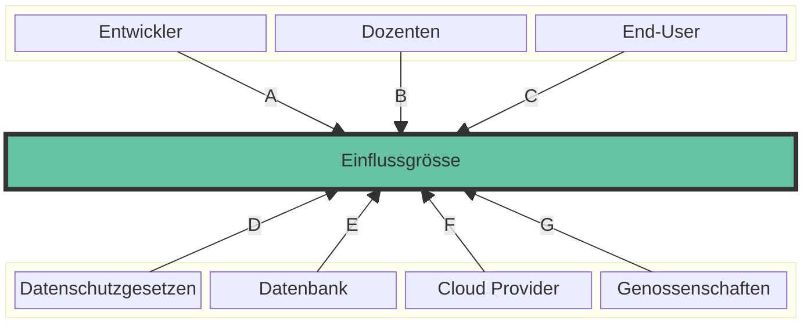
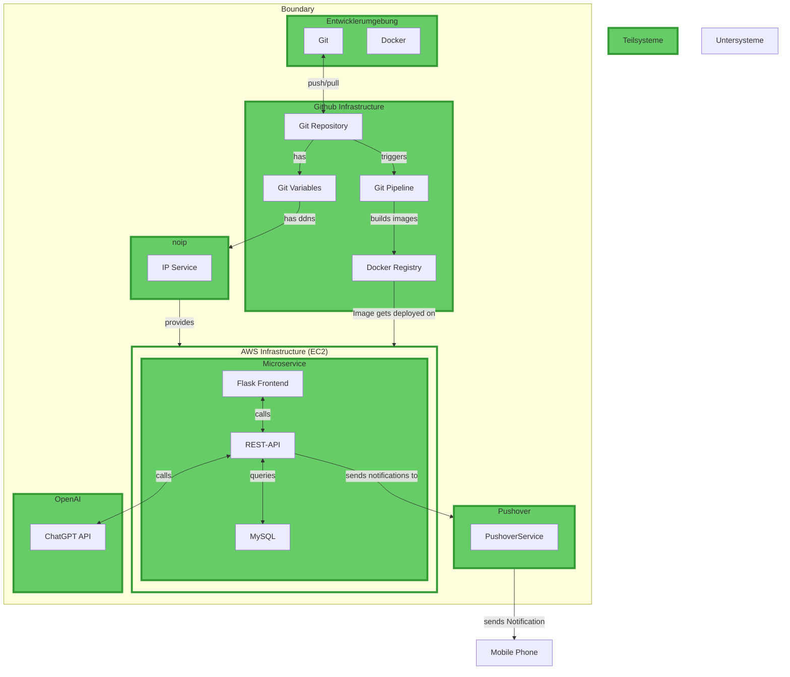

## SEUSAG [^1]

### Systemgrenze definieren

Die Systemgrenze definiert den Umfang des Systems und grenzt es von der Umwelt ab. Sie zeigt, welche Elemente zum System gehören und welche nicht. Die Systemgrenze ist ein wichtiger Bestandteil der Systemanalyse und dient dazu, den Untersuchungsgegenstand klar zu definieren. Sie hilft dabei, die Komplexität des Systems zu reduzieren und die Analyse auf die relevanten Elemente zu fokussieren.

## Schnittstellen

| Schnittstelle | Beschreibung |
|---------------|--------------|
| S1 | Verbindung zwischen der REST-API und der MySQL-Datenbank zur Speicherung und Abfrage von Daten. |
| S2 | Verbindung zwischen dem Flask Frontend und der REST-API zur Bereitstellung von Frontend-Funktionen. |
| S3 | Verbindung zwischen Pushover und der REST-API zur Benachrichtigung der Benutzer. |
| S4 | Verbindung zwischen der Git Pipeline und den Microservices für kontinuierliche Integration und Bereitstellung. |
| S5 | Verbindung zwischen dem End-User und dem Flask Frontend zur Interaktion mit der Benutzeroberfläche. |
| S6 | Direkte Verbindung zwischen dem End-User und der REST-API für API-Abfragen und -Antworten. |
| S7 | Verbindung zwischen dem System zur und der Genossenschaften Wohnungsdaten. |
| S8 | NoIP Dynamic Update Client gets new Public IP Address to link to DDNS Name |
| S9 | Git Variable has a Dynamic Host Name from NoIP |
| S10 | REST API Abfragen zu ChatGPT API |

### Einflussgrössen festhalten

Einflussgrössen sind Faktoren, die das System beeinflussen und von ihm beeinflusst werden. Sie können intern oder extern sein und haben einen Einfluss auf die Leistung, das Verhalten oder die Struktur des Systems. Einflussgrössen können sich im Laufe der Zeit ändern und müssen daher regelmässig überprüft und aktualisiert werden.

### Einflussgrössen und Schnittstellen

Schnittstellen sind die Verbindungen zwischen den einzelnen Systemelementen und ermöglichen den Austausch von Informationen, Energie oder Materie. Sie sind ein wichtiger Bestandteil der Systemanalyse und dienen dazu, die Interaktionen zwischen den Systemelementen zu beschreiben. Die Definition von Schnittstellen hilft dabei, die Beziehungen und Abhängigkeiten im System zu verstehen und zu analysieren.

| **Schnittstelle** | **Einflussgrösse**    | **Beschreibung** |
|-------------------|----------------------|------------------|
| A                 | Entwickler           | Der Entwickler ist verantwortlich für die Programmierung und Implementierung der Systemkomponenten. Meine technischen Fähigkeiten und Effizienz beeinflussen direkt die Qualität des Projekts. |
| B                 | Dozenten             | Die Dozenten überwachen den Fortschritt des Projekts, geben fachliches Feedback und bewerten die Arbeit. Ihr Input kann helfen, die Richtung des Projekts zu korrigieren und die Qualität zu verbessern. |
| C                 | End-User             | Die Nutzer der Plattform, beeinflussen das Projekt durch ihr Feedback und ihre Nutzungsmuster. Ihre Anforderungen und Zufriedenheit sind entscheidend für den Erfolg und die Akzeptanz der Plattform. |
| D                 | Compliance           | Compliance sorgt dafür, dass das Projekt alle relevanten Datenschutzgesetze und -richtlinien einhält. Dies schützt das Projekt vor rechtlichen Problemen. |
| E                 | Datenbank            | Die Datenbank verwaltet und speichert alle relevanten Daten. Ihre Performance und Zuverlässigkeit sind kritisch für die schnelle und korrekte Verarbeitung von Nutzeranfragen und Datenzugriffen. |
| F                 | Cloud Provider       | Der Cloud Provider stellt die notwendige Infrastruktur und Hosting-Dienste zur Verfügung. Er beeinflusst die Skalierbarkeit, Verfügbarkeit und Sicherheit des Systems. |
| G                 | Genossenschaften     | Genossenschaften liefern die Daten zu verfügbaren Wohnungen. Diese Informationen sind entscheidend für die Relevanz und Attraktivität der Plattform für die Nutzer. |

### Unter- und Teilsysteme abgrenzen

Unter- und Teilsysteme sind Bestandteile des Gesamtsystems, die eine spezifische Funktion erfüllen. Sie können als eigenständige Systeme betrachtet werden und haben eine klare Abgrenzung zu anderen Teilsystemen. Die Abgrenzung von Unter- und Teilsystemen hilft dabei, die Komplexität des Gesamtsystems zu reduzieren und die Analyse auf die relevanten Elemente zu fokussieren.

## Analyse Teilsysteme

 [^2]

### Entwicklerumgebung

Die Entwicklerumgebung ist ein Teilsystem des Gesamtsystems, das die Entwicklungsumgebung für die Entwickler bereitstellt. Sie umfasst Tools, Plattformen und Prozesse, die für die Entwicklung, das Testen und die Bereitstellung von Software benötigt werden. Die Entwicklerumgebung spielt eine wichtige Rolle bei der Effizienz, Qualität und Skalierbarkeit des Entwicklungsprozesses.

### AWS Infrastructure

Die AWS-Infrastruktur ist ein Teilsystem des Gesamtsystems, das die Cloud-Infrastruktur für das Projekt bereitstellt. Sie umfasst virtuelle Maschinen, Speicher, Netzwerke und andere Ressourcen, die für die Bereitstellung und den Betrieb des Systems benötigt werden. Die AWS-Infrastruktur bietet Skalierbarkeit, Verfügbarkeit und Sicherheit für das Projekt.

### Github Infrastructure [^5]

Die Github-Infrastruktur ist ein Teilsystem des Gesamtsystems, das die Versionsverwaltung und Continuous Integration für das Projekt bereitstellt. Sie umfasst Git-Repositories, Git-Variablen, Git-Pipelines und Docker-Registries, die für die Entwicklung, das Testen und die Bereitstellung von Software benötigt werden. Die Github-Infrastruktur bietet eine effiziente und kollaborative Entwicklungsumgebung für das Projekt.

### Pushover [^4]

Pushover ist ein Teilsystem des Gesamtsystems, das die Benachrichtigungsfunktion für die Endbenutzer bereitstellt. Es ermöglicht es dem System, Benachrichtigungen über wichtige Ereignisse oder Aktualisierungen an die Endbenutzer zu senden. Pushover spielt eine wichtige Rolle bei der Kommunikation und Interaktion mit den Benutzern.

### noip [^3]

noip ist ein Teilsystem des Gesamtsystems, das die Kosten die durch die Nutzung von AWS Elastic IP entstehen würden zu vermeiden und stellt den dynamischen DNS-Dienst für das Projekt bereit. Es ermöglicht es dem System, eine dynamische IP-Adresse mit einem festen Domainnamen zu verknüpfen. noip spielt eine wichtige Rolle bei der Erreichbarkeit und Zuverlässigkeit des Systems.

### Referenzen

[^1]: Seusag How to [Retrieved from](https://www.studysmarter.de/studium/ingenieurwissenschaften/systemtechnik/systemgrenzen/)
[^2]: Image depicting the concept of analyse Teilsystems [Generated by AI, OpenAI's DALL-E](https://openai.com/index/dall-e-2/)
[^3]: NoIP [Retrieved from](https://www.noip.com/)
[^4]: Pushover [Retrieved from](https://support.pushover.net/i7-what-is-pushover-and-how-do-i-use-it)
[^5]: Github [Retrieved from](https://blog.hubspot.com/website/what-is-github-used-for#:~:text=GitHub%20is%20an%20online%20software,developers%20on%20open%2Dsource%20projects.)