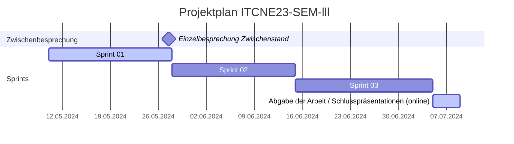
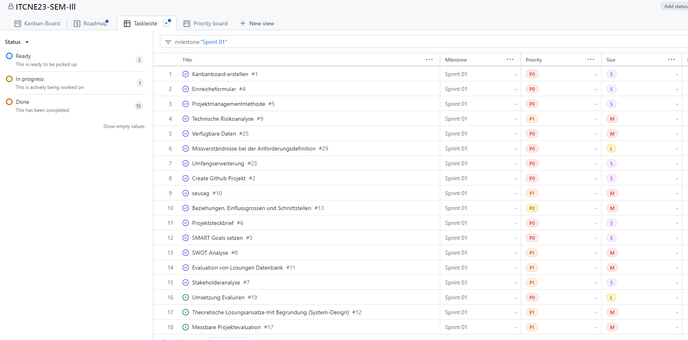
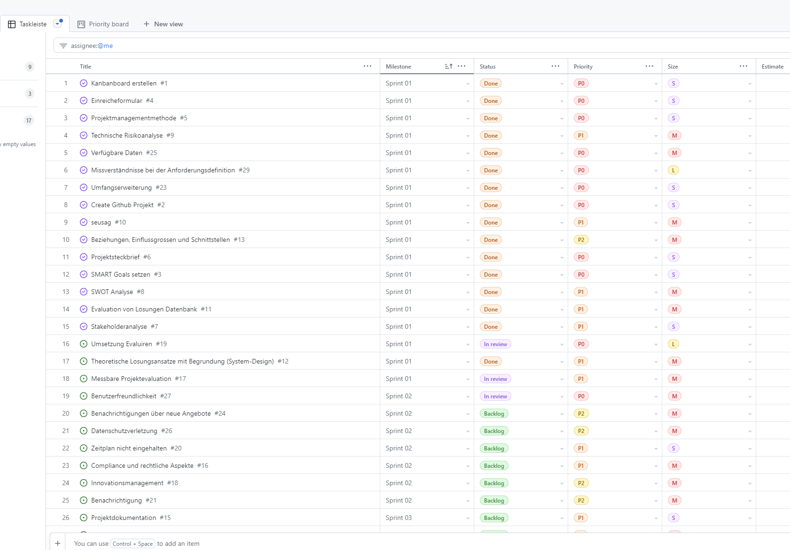

## Sprint 01

| Datum                  | Aktivität                                            | Dauer      |
|-----------------------|------------------------------------------------------|------------|
| 10.05.24 - 27.05.24   | Sprint 01                                            | 18 Tage    |
| 27.05.24              | Einzelbesprechung Zwischenstand                      | 1 Tag      |
| 28.05.24 - 14.06.24   | Sprint 02                                            | 18 Tage    |
| 15.06.24 - 04.07.24   | Sprint 03                                            | 20 Tage    |
| 05.07.24 - 08.07.24   | Abgabe der Arbeit / Schlusspräsentationen (online)   | 4 Tage     |

### Sprint Planning

Folgende Tasks wurden im Sprint 01 geplant:

### Sprint Review

Folgende Tasks wurden im Sprint 01 bearbeitet:

### Sprint Retrospektive

Während dieses Sprints wurde ein erheblicher Aufwand betrieben, um alle projektspezifischen Dokumente im Bereich Projektmanagement zu erstellen. Dieser Aufwand hat sich als sehr zeitaufwändig herausgestellt da viele Dokumente von Grund auf neu erstellt werden mussten.

Dies wurde bewusst so gehandhabt, basierend auf den Schlussfolgerungen der letzten Semesterarbeit. Der Bewertungsraster legt großen Wert auf Projektmanagement, wodurch nur wenige Punkte von den Fachexperten vergeben werden konnten. Ich hoffe, den Aufwand bei zukünftigen Arbeiten reduzieren zu können, da dann bereits Dokumentvorlagen vorhanden sind und in Zukunft wieder mehr Zeit zu haben, um mich auf das Wesentliche zu konzentrieren, nämlich die Umsetzung.

**Keep** Was soll beibehalten werden?

- Zu jedem Task wurde ein Issue erstellt
- Die Issues wurden in der Sprint Backlog Liste priorisiert
- Projektmanagement-Tool wurde effizient genutzt
- Viele Mermaid-Diagramme wurden erstellt

**Drop** Mit was sollen wir aufhören?

- Zeitaufwand bei der Dokumentenerstellung

**Try** Was sollen wir im nächsten Sprint ausprobieren?

- Einführung von Dokumentvorlagen zur Beschleunigung der Erstellung
