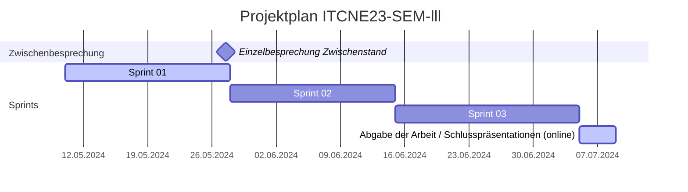
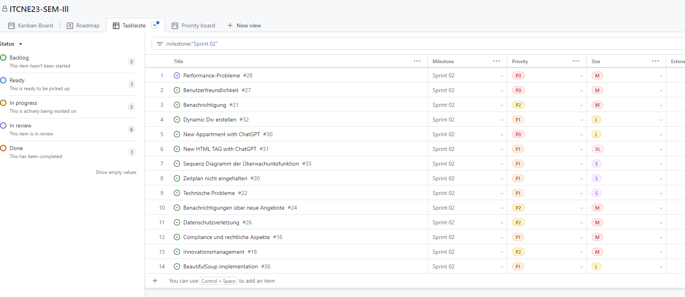
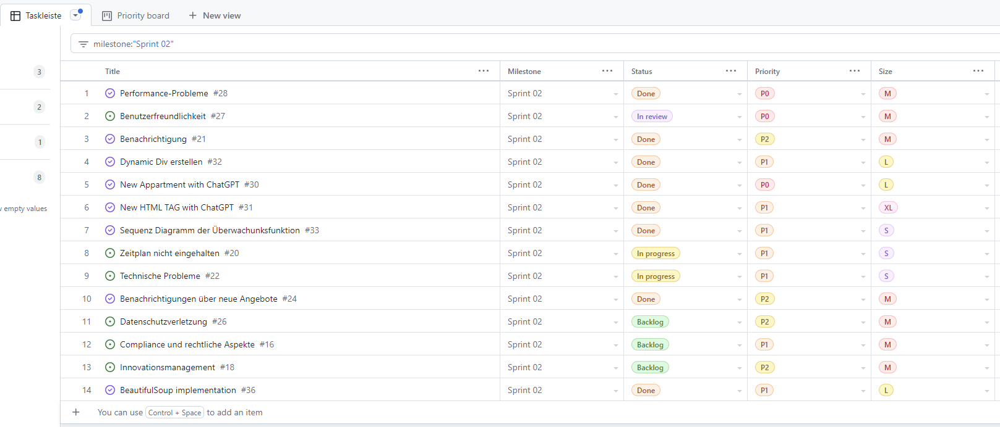

## Sprint 02

| Datum                  | Aktivität                                            | Dauer      |
|-----------------------|------------------------------------------------------|------------|
| 10.05.24 - 27.05.24   | Sprint 01                                            | 18 Tage    |
| 27.05.24              | Einzelbesprechung Zwischenstand                      | 1 Tag      |
| 28.05.24 - 14.06.24   | Sprint 02                                            | 18 Tage    |
| 15.06.24 - 04.07.24   | Sprint 03                                            | 20 Tage    |
| 05.07.24 - 08.07.24   | Abgabe der Arbeit / Schlusspräsentationen (online)   | 4 Tage     |

### Sprint Planning

Folgende Tasks wurden im Sprint 02 geplant:

### Sprint Review

Folgende Tasks wurden im Sprint 02 bearbeitet:

### Sprint Retrospektive

In diesem Sprint habe ich mich auf die Implementierung der Überwachungsfunktion konzentriert. Ich habe die Funktionen `find_div_static` und `find_div_dynamic` implementiert. Die Funktion `find_div_static` sucht nach einem statischen HTML-Element auf der Website des Unternehmens. Die Funktion `find_div_dynamic` sucht nach einem dynamischen HTML-Element auf der Website des Unternehmens.

Die grosse Herausforderung war das implementieren der chatgpt-api. Ich habe die Funktion `ask_chatgpt_about_apartment` implementiert. Diese Funktion fragt die ChatGPT-API nach einem Apartment auf der Website des Unternehmens. Die ChatGPT-API antwortet mit einem Apartment auf der Website des Unternehmens.

Jedoch speziell die Implementierung der Funktion `ask_chatgpt_about_html_class` bin ich sehr stolz. Diese Funktion fragt die ChatGPT-API nach dem HTML-Klassenname des Apartments auf der Website des Unternehmens. Die ChatGPT-API antwortet mit dem HTML-Klassenname des Apartments auf der Website des Unternehmens und ich speichere diesen in der Datenbank des Unternehmens ab wo die Funktion `find_div_dynamic` darauf wieder zugreifen kann.

Das requirements.txt file war auch eine Herausforderung. Ich musste die richtigen Versionen der Bibliotheken finden, damit die Funktionen korrekt funktionieren. Ich habe auch ein Dockerfile erstellt, um die Anwendung in einem Docker-Container zu betreiben.
Damit das Scrapping funktioniert, musste ich die Bibliothek `playwright` installieren. Dies war nicht einfach, da ich auch die richtige Version von playwright finden musste, die mit der Version von Python und den anderen Bibliotheken kompatibel ist.

Die Bibliothek für `grenlet` war auch eine Herausforderung und ich musste auf Python 3.11.0 wechseln, damit die Bibliothek funktioniert.

Des Weiteren habe ich die Funktion `send_message_to_me` implementiert. Diese Funktion sendet eine Benachrichtigung an den Benutzer, wenn sich der Inhalt der Website des Unternehmens geändert hat.

Schlussendlich habe ich die Funktion `update_company_record` implementiert. Diese Funktion aktualisiert den Datensatz des Unternehmens in der Datenbank des Unternehmens.

Schon nur bis man sich in die Thematik eingearbeitet hat, hat sehr viel Zeit in Anspruch genommen.
Da man sich noch so sehr planen kann jedoch immer wieder auf unerwartete Probleme stösst, die man erst bei der Umsetzung erkennt.

Ich bin jedoch sehr zufrieden mit dem Resultat und freue mich auf die nächsten Schritte.
Speziell die Implementierung der KI mit der Idee ein selbstlernende Funktion einzubauen hat mir sehr viel Spass gemacht.

Es gab viel Ausprobieren und Fehlerbehebung in diesem Sprint. Ich musste Funktionen mehrmals neu schreiben, um sie zum Laufen zu bringen. Ich habe auch mehr Bibliotheken installiert, als ich geplant hatte. Im nächsten Sprint werde ich versuchen, es einfacher zu halten und mehr zu testen.

**Keep** Was soll beibehalten werden?

- Probieren und Fehler machen
- Funktionen in kleine Teile aufteilen

**Drop** Mit was soll ich aufhören?

- Funktionen ständig umschreiben
- Weitere Bibliotheken installieren

**Try** Was soll ich im nächsten Sprint ausprobieren?

- Simplicity
- Mehr testen
