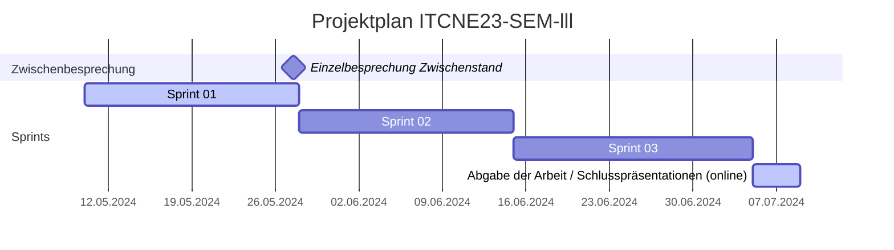

## Sprint 02

| Datum                  | Aktivität                                            | Dauer      |
|-----------------------|------------------------------------------------------|------------|
| 10.05.24 - 27.05.24   | Sprint 01                                            | 18 Tage    |
| 27.05.24              | Einzelbesprechung Zwischenstand                      | 1 Tag      |
| 28.05.24 - 14.06.24   | Sprint 02                                            | 18 Tage    |
| 15.06.24 - 04.07.24   | Sprint 03                                            | 20 Tage    |
| 05.07.24 - 08.07.24   | Abgabe der Arbeit / Schlusspräsentationen (online)   | 4 Tage     |



### Sprint Planning

Folgende Tasks wurden im Sprint 02 geplant:


### Sprint Review

Folgende Tasks wurden im Sprint 02 bearbeitet:


### Sprint Retrospektive

Docker file  
```Dockerfile
# Install the dependencies
RUN apt-get update && apt-get install -y build-essential
RUN pip install -r requirements.txt
```

And the requirements.txt file

```txt
apiflask==2.1.0
mysql-connector-python==8.0.32
flask-sqlalchemy==3.0.3
pyjwt==2.8.0
Flask-MonitoringDashboard==3.3.0
beautifulsoup4==4.12.2
playwright==1.35.0
ua-generator==0.4.0
protobuf==3.19.0
```
Took some time to find out.

Ich hatte probleme grenlet zu installieren mit dem Python version 3.12.0. Ich musste auf die Version 3.11.0 wechseln.

**Keep** Was soll beibehalten werden?

- Z

**Drop** Mit was sollen wir aufhören?

- Z

**Try** Was sollen wir im nächsten Sprint ausprobieren?

- Z
