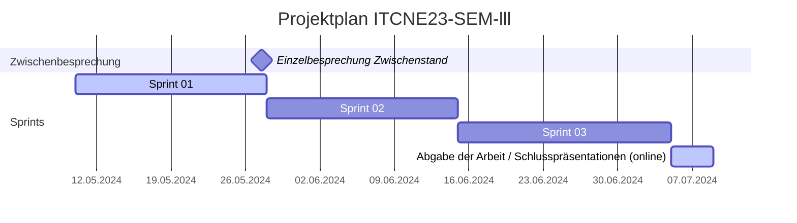
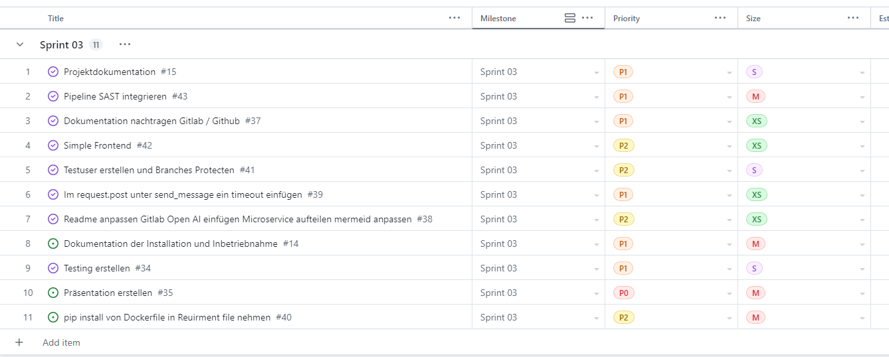
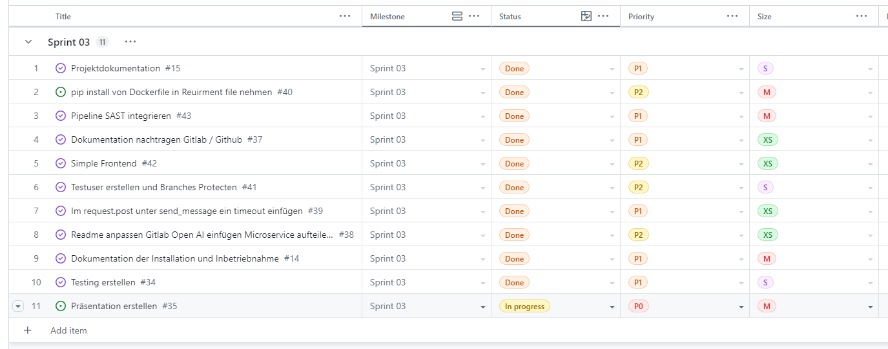

## Sprint 03

| Datum                  | Aktivität                                            | Dauer      |
|-----------------------|------------------------------------------------------|------------|
| 10.05.24 - 27.05.24   | Sprint 01                                            | 18 Tage    |
| 27.05.24              | Einzelbesprechung Zwischenstand                      | 1 Tag      |
| 28.05.24 - 14.06.24   | Sprint 02                                            | 18 Tage    |
| 15.06.24 - 04.07.24   | Sprint 03                                            | 20 Tage    |
| 05.07.24 - 08.07.24   | Abgabe der Arbeit / Schlusspräsentationen (online)   | 4 Tage     |

### Sprint Planning

Folgende Tasks wurden im Sprint 03 geplant:

### Sprint Review

Folgende Tasks wurden im Sprint 03 bearbeitet:

### Sprint Retrospektive

#### Dockerfile

Leider konnte ich die Dockerfiles nicht wie geplant fertigstellen. Da für die Verwendung von `lxml` System Packages benötigt werden, die nicht im requirements.txt installiert werden können.
Die schönste Lösung wäre es, bei Web Scrapping auf Bibliotheken zu verzichten, die System Packages benötigen.

#### Error Handling

Ich habe viel Zeit damit verbracht, ein Error Handling für die Funktionen zu implementieren. Das Error Handling ist jetzt robuster und die Funktionen können mehr Edge Cases behandeln. Speziell die Verwendung von Timeouts nach `Requests` hat das Error Handling verbessert.

#### Umfrageergebnisse

Umfrageergebnisse sind eingetroffen und werden in die Weiterentwicklung der Plattform einbezogen. Die Umfrageergebnisse zeigen, dass die Nutzer eine Filterfunktion wünschen.
Sowie der Fokus auf Funktionalität und Datenschutz gelegt werden soll.
Es war eine Herausforderung, die sinnvoll zu gestalten und auszuwerten.
Leider konnte ich die Umfrageergebnisse nicht in diesen dritten Sprints integriert, da dies ausserhalb des Scopes liegt. Sie wird jedoch in den nächsten Sprint eingeplant und sicher für die Weiterentwicklung der Plattform berücksichtigt.

**Keep** Was soll beibehalten werden?

- Error Handling für die Funktionen.
- Timeouts für die Anfragen.

**Drop** Mit was soll ich aufhören?

- Dockerfiles zu erstellen, die System Packages benötigen.

**Try** Was soll ich im nächsten Sprint ausprobieren?

- Umfrageergebnisse in den nächsten Sprints zu integrieren.
