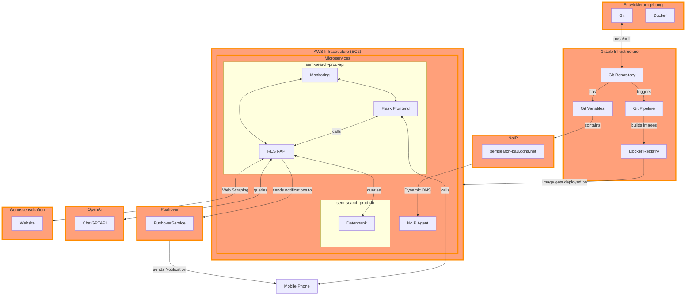

## Theoretischer Lösungsansatz

Die in der Planung erarbeiteten Anforderungen und Ziele sollen in diesem Kapitel in einem theoretischen Lösungsansatz zusammengefasst werden.
Dieser Lösungsansatz soll die Grundlage für die spätere Umsetzung bilden.

Im Prinzip soll die Plattform die Möglichkeit bieten, Webseiten einzelner Genossenschaftswohnungen einer Liste hinzuzufügen und zu verwalten.
Auf diesen Webseiten sollte regelmässig nach neuen Wohnungsangeboten gesucht werden.
Sobald ein neuer Eintrag erscheint, sollte eine Benachrichtigung an den Benutzer gesendet werden. Diese Benachrichtigung sollte direkt auf das Smartphone des Benutzers zugestellt werden.

Dieses Projekt soll Open Source sein und für alle zugänglich und erschwinglich sein.

### Architektur

Für das Projekt werden Microservices verwendet, um mehrere Vorteile zu nutzen: erhöhte Flexibilität und Skalierbarkeit, erleichterte Wartung und Weiterentwicklung sowie verbesserte Ausfallsicherheit durch die Isolierung von Diensten. Als Programmiersprache wird Python eingesetzt, da es eine der beliebtesten Programmiersprachen ist und eine Vielzahl von Bibliotheken und Frameworks bietet, die die Entwicklung erleichtern.

### Datenbank

Als Datenbank wird MongoDB oder Datenbank verwendet, da beide Datenbanken eine hohe Leistung und Skalierbarkeit bieten.

### Frontend

Die Benutzeroberfläche ist in HTML geschrieben und sehr einfach gehalten, da es nicht der Schwerpunkt des Projekts ist. Die Benutzeroberfläche wird mit dem Flask-Framework erstellt, da es einfach zu bedienen ist und eine Vielzahl von Erweiterungen bietet, die die Entwicklung erleichtern.

### Benachrichtigungsdienst

Die Benachrichtigungen werden über die Pushover-API gesendet, da sie einfach zu bedienen ist und eine Vielzahl von Funktionen bietet, die die Entwicklung erleichtern.

### DevOps

Die Plattform wird in Docker-Containern bereitgestellt, um die Bereitstellung und Skalierung zu vereinfachen. Die Container werden mit Docker Compose verwaltet, um die Konfiguration zu vereinfachen und die Wartung zu erleichtern.

Die Plattform wird auf einem virtuellen Server gehostet, um die Skalierbarkeit und Ausfallsicherheit zu gewährleisten. Der Server wird von einem Cloud-Anbieter bereitgestellt, um die Wartung und den Betrieb zu vereinfachen.
CI/CD-Pipelines werden verwendet, um die Bereitstellung zu automatisieren und die Qualität zu gewährleisten und die Verwendung durch dritte zu vereinfachen.

Die Plattform wird in einem Git-Repository verwaltet, um die Zusammenarbeit zu erleichtern und die Versionskontrolle zu gewährleisten.

### Monitoring

Als Monitoring-Tool wird flask_monitoringdashboard verwendet, da es einfach zu bedienen ist und eine Vielzahl von Funktionen bietet, die die Überwachung und Wartung erleichtern.

## Service Design

## Begründung

Der gewählte Lösungsansatz nutzt eine moderne, skalierbare Architektur und bewährte Technologien, um Flexibilität und Effizienz zu maximieren.
Die automatisierte Prozesse in der Entwicklung und Bereitstellung erhöhen die Zuverlässigkeit und Geschwindigkeit des Projekts.
Monitoring-Tools sorgen für eine proaktive Überwachung und Wartung, während Benachrichtigungsdienste die Benutzerfreundlichkeit verbessern.
Die Verwendung von Open-Source-Technologien und Cloud-Hosting ermöglicht eine kostengünstige und zugängliche Lösung für alle Benutzer.
