## Zeitplan

Für die Planung und Durchführung des Projektes wurde ein fixer Zeitplan vorgegeben.
Der Zeitplan ist in der folgenden Tabelle dargestellt.

| Datum                  | Aktivität                                            | Wer         | An       |
|-----------------------|----------------------                                 | ------------|----      |
|03.05.24               | Produktions                                           | Studierende |          |
|06.05.24 - 10.05.24    | Abgabe Einreichungsformular Semesterarbeit            | Studierende | Expert   |
|27.05.24               | Einzelbesprechung Zwischenstand                       | Studierende | Expert   |
|05.07.24 - 08.07.24    | Abgabe der Arbeit / Schlusspräsentationen (online)    | Studierende |          |
|14.07.24               | Notenvorschlag                                        | Expert      | Lehrgangsleiter |
|21.07.24               | Mitteilung der Noten                                  | Lehrgangsleiter | Studierende |

Um den detaillierten Zeitplan einzusehen, öffnen Sie bitte das Projektmanagement-Tool auf ([Github Project](https://github.com/users/danyambuehl/projects/3)). Dort finden Sie alle Informationen zur Projektplanung.

```mermaid
gantt
    title Projektplan ITCNE23-SEM-lll
    dateFormat  DD.MM.YY
    section Produktionsphase
    Produktions            :done, prod, 03.05.24, 1d
    section Einreichung
    Abgabe Einreichungsformular Semesterarbeit: active, submit, 06.05.24, 5d
    section Zwischenbesprechung
    Einzelbesprechung Zwischenstand: milestone, meet, 27.05.24, 1d
    section Abschlussphase
    Abgabe der Arbeit / Schlusspräsentationen (online) : active, present, 05.07.24, 4d
    Notenvorschlag                                      : note, grade_suggestion, 14.07.24, 1d
    Mitteilung der Noten                                : milestone, grades_announcement, 21.07.24, 1d
```

```mermaid
gantt
    title Git Issues - days since last update
    dateFormat  X
    axisFormat %s

    section Issue19062
    71   : 0, 71
    section Issue19401
    36   : 0, 36
    section Issue193
    34   : 0, 34
    section Issue7441
    9    : 0, 9
    section Issue1300
    5    : 0, 5
```

