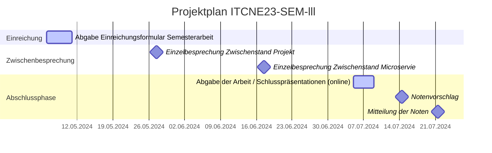

## Zeitplan

Für die Planung und Durchführung des Projektes wurde ein fixer Zeitplan vorgegeben.
Der Zeitplan ist in der folgenden Tabelle dargestellt.

Um den detaillierten Zeitplan einzusehen, öffnen Sie bitte das Projektmanagement-Tool auf ([Github Project](https://github.com/users/danyambuehl/projects/3)). Dort finden Sie alle Informationen zur Projektplanung.

| Datum                  | Aktivität                                            | Wer         | An       |
|-----------------------|----------------------                                 | ------------|----      |
|06.05.24 - 10.05.24    | Abgabe Einreichungsformular Semesterarbeit            | Studierende | Expert   |
|27.05.24               | Einzelbesprechung Zwischenstand                       | Studierende | Expert   |
|05.07.24 - 08.07.24    | Abgabe der Arbeit / Schlusspräsentationen (online)    | Studierende |          |
|14.07.24               | Notenvorschlag                                        | Expert      | Lehrgangsleiter |
|21.07.24               | Mitteilung der Noten                                  | Lehrgangsleiter | Studierende |
