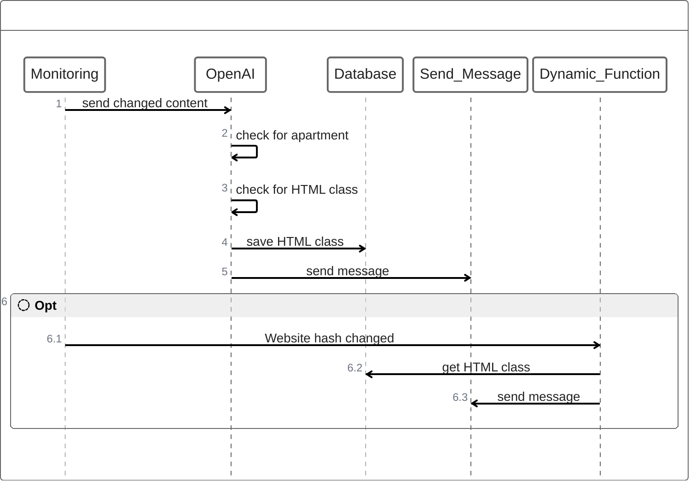
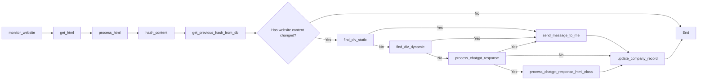

## Überwachungsfunktion

Die Überwachungsfunktion ist die Hauptfunktion der Plattform. Sie überwacht die Website des Unternehmens und benachrichtigt den Benutzer, wenn sich der Inhalt der Website ändert.

Der von mir implementierte Lösungsansatz basiert auf künstlicher Intelligenz (KI) und beinhaltet eine Methode des selbstgesteuerten Lernens. Wenn die KI ein Apartment auf einer Webseite erkennt, wird nicht nur eine Benachrichtigung versendet. Vielmehr sucht die KI mithilfe einer gezielten Frage auch den entsprechenden HTML-Klassenname des Apartments und schreibt diesen in die Datenbank des Unternehmens. Bei zukünftigen Aufrufen der Webseite erkennt die Funktion `find_div_dynamic` dann sofort, ob ein neues Apartment ausgeschrieben wurde.

Auf diese Weise werden Kosten für KI-Anfragen vermieden, da die KI bereits identifiziert hat, wie man ein neues Apartment eigenständig identifizieren kann.

<!-- ## Selbstlernende Funktion

## Flowchart Ablauf

Hier ist der Ablauf der Überwachungsfunktion in einem Flowchart dargestellt.

