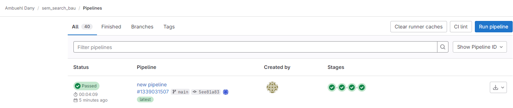
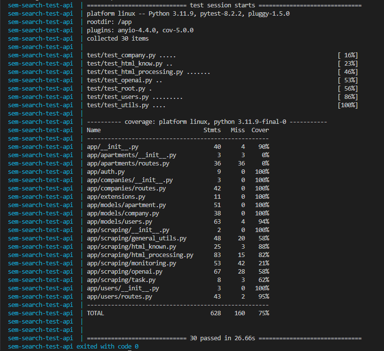

## Manuelle Tests

Hier werden einige Manuelle Tests durchgeführt um die Funktionen zu überprüfen.


| Description | Test Step | Expected Result | Status | Screen |
| ---         | ---       | ---             | ---    |  ---   |
| `find_div_dynamic`| Wohung mit der find_div:dynamic finden und informieren | find_div_dynamic success log and message send  | true | [Screenshot](../img/testing/find_div_dynamic.png) |
| `find_div_dynamic`| Neue Class Name gleiches Ziel für find_div_dynamic | find_div_dynamic neuer classnam success log and message send  | Device Paused | [Screenshot](../img/testing/find_div_dynamic2.png) |
| `find_div_dynamic`| Neue Class Name aus Datenbank auslesen | grid-item wohnung22  | grid-item wohnung22 | [Screenshot](../img/testing/find_div_dynamic3.png) |
| `no changes`| keine Änderungen auf Website | gleicher hash kein update  | erfolgreich | [Screenshot](../img/testing/same_hash.png) |
| `changes`| Änderungen auf Website | neuer hash update  | erfolgreich | [Screenshot](../img/testing/new_hash.png) |
| `find apartment` | Wohnung finden mit ChatGPT | Yes, there is at least one new apartment listed in the HTML content  | erfolgreich | [Screenshot](../img/testing/chat_gpt_response.png) |
| `find html class` | HTML Class Name finden mit ChatGPT | ask_chatgpt_about_html_class: HTML Tag: <div>, Full Class Name: grid-item wohnung11  | grid-item wohnung22 | [Screenshot](../img/testing/chat_gpt_response_html.png) |
| `update company record` | Update Company Record class_name | grid-item wohnung11  | erfolgreich | [Screenshot](../img/testing/chat_gpt_response_html_updatet.png) |

## Automatisches Testing


Hier werden einige Automatische Tests durchgeführt um die Funktionen zu überprüfen.

### Pipline SAST Testing

Ich habe eine einfache Pipeline erstellt, die die Sicherheit des Codes überprüft.



Bei der ersten Überprüfung des Codes wurden eine kleiner Fehler gefunden:

```json
{"version":"15.1.0","vulnerabilities":[{"id":"a3d98d65cd227205602da94970e6098191dae34a783d29c820e7077746722811","category":"sast","name":"Uncontrolled resource consumption","description":"The application was found using the `requests` module without configuring a timeout value for\nconnections. This could lead to uncontrolled resource consumption where the application could\nrun out of\nsocket descriptors, effectively causing a Denial of Service (DoS).\n\nTo remediate this issue, pass in a `timeout=` argument to each `requests` call.\n\nExample using a timeout for an HTTP GET request:\n```\n# Issue a GET request to https://example.com with a timeout of 10 seconds\nresponse = requests.get('https://example.com', timeout=10)\n# Work with the response object\n# ...\n```\n\nFor more information on using the requests module see:\n- https://requests.readthedocs.io/en/latest/api/\n","cve":"semgrep_id:bandit.B113:94:94","severity":"Medium","scanner":{"id":"semgrep","name":"Semgrep"},"location":{"file":"app/scraping/general_utils.py","start_line":94},"identifiers":[{"type":"semgrep_id","name":"bandit.B113","value":"bandit.B113","url":"https://semgrep.dev/r/gitlab.bandit.B113"},{"type":"cwe","name":"CWE-400","value":"400","url":"https://cwe.mitre.org/data/definitions/400.html"},{"type":"owasp","name":"A05:2021 - Security Misconfiguration","value":"A05:2021"},{"type":"owasp","name":"A6:2017 - Security Misconfiguration","value":"A6:2017"},{"type":"bandit_test_id","name":"Bandit Test ID B113","value":"B113"}]}],"scan":{"analyzer":{"id":"semgrep","name":"Semgrep","url":"https://gitlab.com/gitlab-org/security-products/analyzers/semgrep","vendor":{"name":"GitLab"},"version":"5.3.0"},"scanner":{"id":"semgrep","name":"Semgrep","url":"https://github.com/returntocorp/semgrep","vendor":{"name":"GitLab"},"version":"1.72.0"},"type":"sast","start_time":"2024-06-19T13:39:21","end_time":"2024-06-19T13:39:33","status":"success"}}
```

Nachdem ich die Fehler behoben habe, wurde die Pipeline erfolgreich durchgeführt.

```json
{"version":"15.1.0","vulnerabilities":[],"scan":{"analyzer":{"id":"semgrep","name":"Semgrep","url":"https://gitlab.com/gitlab-org/security-products/analyzers/semgrep","vendor":{"name":"GitLab"},"version":"5.3.0"},"scanner":{"id":"semgrep","name":"Semgrep","url":"https://github.com/returntocorp/semgrep","vendor":{"name":"GitLab"},"version":"1.72.0"},"type":"sast","start_time":"2024-06-19T13:51:37","end_time":"2024-06-19T13:51:49","status":"success"}}

```

### Pytest Testing

Ich habe einige Pytest-Tests geschrieben, um die Funktionen zu überprüfen.



### Pytest Coverage Testing

**app/apartments/routes.py**

Das Coverage für routes.py in Apartments ist bei 0%.

Da die Apartments routes soweit nur als code geschrieben wurden jedoch noch nicht verwendet wird und die vollständige Implementierung für den nächsten Sprint geplant ist.

```python
# app/__init__.py
    # Register blueprints here
    from app.companies import bp as companies_bp
    app.register_blueprint(companies_bp, url_prefix='/companies')

    # from app.apartments import bp as apartments_bp
    # app.register_blueprint(apartments_bp, url_prefix='/apartments')

    from app.users import bp as users_bp
    app.register_blueprint(users_bp, url_prefix='/users')
```

**openai.py**

Es hat viele Exception handling tests die ich nicht explizit getestet habe da es zu viele sind.

Die Coverage für openai.py ist 58%. Da die ganzen exceptions nicht getestet wurden.

```python
def ask_chatgpt_about_apartment(html_content):
    try:
        response = client.chat.completions.create(
            model="gpt-4o",
            messages=[
                {"role": "system", "content": "You are a helpful assistant skilled in parsing HTML content."},
                {"role": "user", "content": f"Check if there are new apartments listed in the following HTML content:\n{html_content} and respond in the format 'yes apartment found or no apartment found'."}
            ],
            max_tokens=500,
            timeout=60
        )
        logger.info(f"ChatGPT response for ask_chatgpt_about_apartment: {response.choices[0].message.content.strip()}")
        return response.choices[0].message.content.strip()
    except openai.APIConnectionError as e:
        logger.error("The server could not be reached")
        logger.error(e.__cause__)
    except openai.RateLimitError as e:
        logger.error("A 429 (RateLimitError) status code was received; we should back off a bit.")
        time.sleep(time_to_wait)  # wait before retrying
    except openai.APIStatusError as e:
        logger.error("Another non-200-range status code was received")
        logger.error(e.status_code)
        logger.error(e.response)
```

